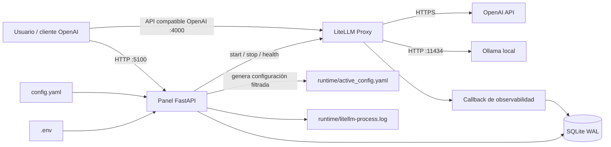

# IA Gateway · Guía técnica de la versión beta


IA Gateway convierte una configuración declarativa de LiteLLM en una experiencia
operable desde el navegador: arranque y parada reales, modelos activables,
pruebas inmediatas, observabilidad por petición y métricas de proceso. Todo se
ejecuta localmente y conserva una API compatible con OpenAI en el puerto `4000`.

> Estado del proyecto: la versión funcional anterior está congelada en el tag
> Git `alpha`. Este documento describe la evolución `beta`.

## 1. Qué problema resuelve

LiteLLM es un gateway potente, pero operarlo únicamente desde terminal obliga a
combinar procesos, YAML, logs y herramientas de sistema. IA Gateway añade una
capa de control deliberadamente pequeña:

- un único lugar para arrancar y detener el proxy;
- una vista de salud que sólo dice «Activo» cuando el puerto responde;
- activación temporal de modelos sin destruir `config.yaml`;
- pruebas de chat y embeddings desde pestañas independientes;
- logs de entrada y salida, IPs, latencia inicial y duración total;
- métricas de CPU/RAM de LiteLLM y memoria de modelos Ollama;
- secretos fuera del repositorio mediante `.env`.

## 2. Arquitectura



### Dos puertos, dos responsabilidades

| Puerto | Servicio | Propósito |
|---:|---|---|
| `5100` | Panel FastAPI | Interfaz, control, pruebas y consulta de logs |
| `4000` | LiteLLM Proxy | Gateway consumido por aplicaciones y SDKs OpenAI |
| `11434` | Ollama | Inferencia local, si Ollama está instalado |

El panel nunca suplanta al gateway. Las aplicaciones siguen llamando al puerto
`4000`; el puerto `5100` sólo administra y observa.

## 3. Recorrido de una petición

1. Un cliente envía una petición compatible con OpenAI a LiteLLM.
2. LiteLLM busca el alias solicitado en `runtime/active_config.yaml`.
3. El proxy traduce la petición al proveedor OpenAI u Ollama.
4. El callback recibe inicio, primer resultado, final, metadatos y respuesta.
5. El callback oculta campos sensibles y escribe el evento en SQLite.
6. La web consulta SQLite y presenta el evento en la pestaña del modelo.

La zona «Prueba rápida» sigue exactamente el mismo camino. Por eso una prueba
hecha desde el panel también aparece en los logs y valida el sistema completo.

## 4. Estructura del repositorio

```text
ia-gateway/
├── app.py                         # API del panel y servidor web :5100
├── config.yaml                    # Fuente de verdad de modelos LiteLLM
├── .env                           # Secretos locales; nunca se versiona
├── .env.example                   # Plantilla segura de variables
├── requirements.txt               # Dependencias de producción fijadas
├── requirements-dev.txt           # Dependencias de desarrollo y tests
├── gateway/
│   ├── core.py                    # Ciclo de vida, salud y métricas
│   ├── litellm_callback.py        # Captura de llamadas y latencias
│   └── log_store.py               # Persistencia y migración SQLite
├── static/
│   ├── index.html                 # Estructura semántica del dashboard
│   ├── app.js                     # Estado y comportamiento del navegador
│   └── style.css                  # Sistema visual beta
├── tests/
│   ├── test_app.py                # Contrato HTTP y comportamiento web
│   └── test_core.py               # Configuración, logs y seguridad
├── docs/assets/
│   └── ia-gateway-beta-infografia.png
└── runtime/                       # Estado generado; excluido de Git
    ├── active_config.yaml         # Config LiteLLM filtrada
    ├── litellm_callback.py        # Copia importable junto al config
    ├── litellm.pid                # PID del supervisor
    ├── litellm-process.log        # stdout/stderr directo
    ├── requests.sqlite3           # Observabilidad estructurada
    └── state.json                 # Modelos temporalmente desactivados
```

### Regla de oro

Edita `config.yaml`, nunca `runtime/active_config.yaml`. El segundo se regenera
al arrancar LiteLLM o cambiar el estado de un modelo.

## 5. Instalación desde cero

### Dependencias y por qué existen

| Dependencia | Versión | Responsabilidad |
|---|---:|---|
| `litellm[proxy]` | `1.83.9` | Gateway compatible con OpenAI y normalización de proveedores. |
| `FastAPI` | `0.124.4` | API del panel y entrega de la interfaz web. |
| `Uvicorn` | `0.33.0` | Servidor ASGI que escucha en el puerto `5100`. |
| `httpx` | `0.28.1` | Comprobaciones de salud y llamadas de prueba a LiteLLM. |
| `psutil` | `>=6.1,<8` | CPU, memoria, árbol de procesos y puertos. |
| `PyYAML` | `>=6.0,<7` | Lectura y escritura segura de la configuración de modelos. |
| `python-dotenv` | `1.0.1` | Carga local de secretos desde `.env`. |
| `pytest` | `>=8.3,<9` | Pruebas automatizadas; solo se instala para desarrollo. |

Las versiones están acotadas para que dos instalaciones realizadas en momentos distintos produzcan un entorno reproducible.

### Requisitos

- macOS o Linux;
- Python 3.9 o posterior;
- acceso de red para proveedores remotos;
- Ollama opcional para los modelos locales;
- una API key y facturación API independiente si se usa OpenAI.

### Crear el entorno aislado

```bash
git clone <URL-DEL-REPOSITORIO> ia-gateway
cd ia-gateway

python3 -m venv .venv
source .venv/bin/activate
python -m pip install --upgrade pip
python -m pip install -r requirements.txt
```

### Configurar secretos

```bash
cp .env.example .env
```

Edita únicamente `.env`:

```dotenv
OPENAI_API_KEY=sk-tu-clave-real
```

No pongas secretos en `config.yaml`, `active_config.yaml`, capturas, commits o
logs. `.env` ya está ignorado por Git.

### Configurar modelos

```yaml
model_list:
  - model_name: topito
    litellm_params:
      model: openai/gpt-5.6-sol
      api_key: os.environ/OPENAI_API_KEY
      reasoning_effort: high
      drop_params: true

  - model_name: embedding-local
    litellm_params:
      model: ollama/bge-m3:latest
      api_base: http://localhost:11434
      keep_alive: -1
      drop_params: true
```

`model_name` es el alias estable que usan tus aplicaciones. El valor `model`
puede cambiar sin obligar a modificar los consumidores.

### Arrancar

```bash
source .venv/bin/activate
python app.py
```

Abre <http://127.0.0.1:5100>, pulsa **Arrancar** y espera a que el estado indique
`Activo · 127.0.0.1:4000`. El panel no declara el servicio activo hasta comprobar
que el puerto acepta conexiones.

## 6. Consumir el gateway

### cURL

```bash
curl http://127.0.0.1:4000/v1/chat/completions \
  -H 'Content-Type: application/json' \
  -d '{
    "model": "topito",
    "messages": [{"role": "user", "content": "Escribe SELECT 1"}]
  }'
```

### SDK de OpenAI

```python
from openai import OpenAI

client = OpenAI(
    base_url="http://127.0.0.1:4000/v1",
    api_key="local-not-used",
)

response = client.chat.completions.create(
    model="topito",
    messages=[{"role": "user", "content": "Hola"}],
)
print(response.choices[0].message.content)
```

## 7. API interna del panel

| Método | Ruta | Función |
|---|---|---|
| `GET` | `/api/status` | Salud, PID, puerto, CPU y RAM |
| `GET` | `/api/models` | Modelos y estado efectivo |
| `GET` | `/api/model-resources` | Recursos locales/remotos por modelo |
| `POST` | `/api/gateway/start` | Genera config y arranca LiteLLM |
| `POST` | `/api/gateway/stop` | Detiene el grupo de procesos |
| `PUT` | `/api/models/{name}/state` | Activa o desactiva un alias |
| `POST` | `/api/models/{name}/test` | Prueba chat o embeddings |
| `GET` | `/api/models/{name}/logs` | Eventos estructurados del modelo |
| `GET` | `/api/process-log` | Salida directa de LiteLLM |

Swagger está disponible en <http://127.0.0.1:5100/api/docs>.

## 8. Observabilidad

Cada evento nuevo conserva:

- timestamp de inicio, presentado en `Europe/Madrid`;
- alias de modelo y estado (`success` o `error`);
- IP de origen, respetando `X-Forwarded-For`;
- IP IPv4 resuelta del endpoint proveedor;
- tiempo hasta inicio de respuesta (`ttft_ms`);
- duración total (`duration_ms`);
- entrada y salida serializadas;
- excepción normalizada cuando la llamada falla.

En llamadas no streaming, LiteLLM puede entregar el primer resultado junto con
la respuesta completa; en ese caso TTFT y duración total serán iguales.

SQLite usa modo WAL para permitir que el callback escriba mientras la interfaz
consulta. Las migraciones son aditivas y se ejecutan al abrir la base, por lo que
los logs históricos no se destruyen.

## 9. Métricas y alcance

- **LiteLLM:** CPU normalizada sobre todos los cores y RSS del árbol de procesos.
- **Ollama:** CPU compartida del servicio, memoria del modelo y VRAM informadas
  por `/api/ps`.
- **OpenAI:** se marca como remoto; no es posible inspeccionar CPU/RAM del
  proveedor desde el equipo local.

No se presenta una precisión falsa: varios modelos Ollama pueden compartir el
mismo servidor y su CPU no es atribuible de forma fiable a una sola tarjeta.

## 10. Seguridad

El panel escucha sólo en `127.0.0.1`. Si se expone a una red, añade antes:

- autenticación fuerte;
- TLS mediante reverse proxy;
- una `master_key` de LiteLLM;
- control de acceso por red;
- política de retención de prompts y respuestas;
- redacción adicional para datos personales.

El logger oculta claves frecuentes (`authorization`, `api_key`, `token`,
`secret`), pero los prompts y respuestas pueden contener información sensible.

## 11. Desarrollo y pruebas

```bash
source .venv/bin/activate
python -m pip install -r requirements-dev.txt
PYTHONDONTWRITEBYTECODE=1 python -m pytest -q
```

Los tests cubren filtrado de modelos, preservación de `config.yaml`, redacción de
secretos, migraciones de metadatos, detección de embeddings, validación de
variables de entorno, contrato HTTP, anti-caché y pestañas de prueba.

## 12. Diagnóstico rápido

### «Proceso vivo, puerto sin servicio»

Consulta la pestaña **LiteLLM**. El panel diferencia el supervisor del endpoint:
un PID sin puerto operativo aparece como `Sin servicio`, nunca como activo.

### `AuthenticationError`

Confirma que `.env` existe, que contiene `OPENAI_API_KEY` y que reiniciaste
completamente `python app.py` después de editarlo.

### `RateLimitError: exceeded your current quota`

La cuota de ChatGPT Plus no incluye la API. Revisa saldo y facturación en la
plataforma API y verifica que la key pertenece al proyecto correcto.

### No aparecen IPs o latencias

Los registros anteriores a la migración no tienen esos campos. Detén y vuelve a
arrancar LiteLLM para cargar el callback actual, realiza una nueva petición y
fuerza una recarga del navegador si la webapp anterior seguía abierta.

### Ollama aparece «no cargado»

Significa que Ollama responde pero aún no mantiene ese modelo en memoria. Haz una
primera llamada; `keep_alive: -1` lo conservará cargado.

## 13. Versionado

```bash
# Volver exactamente a la versión funcional inicial
git switch --detach alpha

# Regresar a la línea actual
git switch main
```

`alpha` es la línea base funcional. `beta` añade documentación, enseñanza en el
código y una identidad visual más ambiciosa sin romper los contratos HTTP ni la
estructura operativa.
