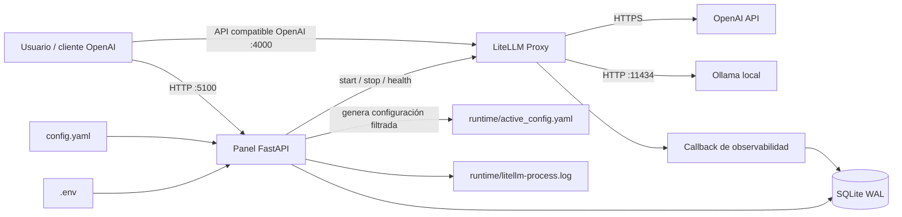
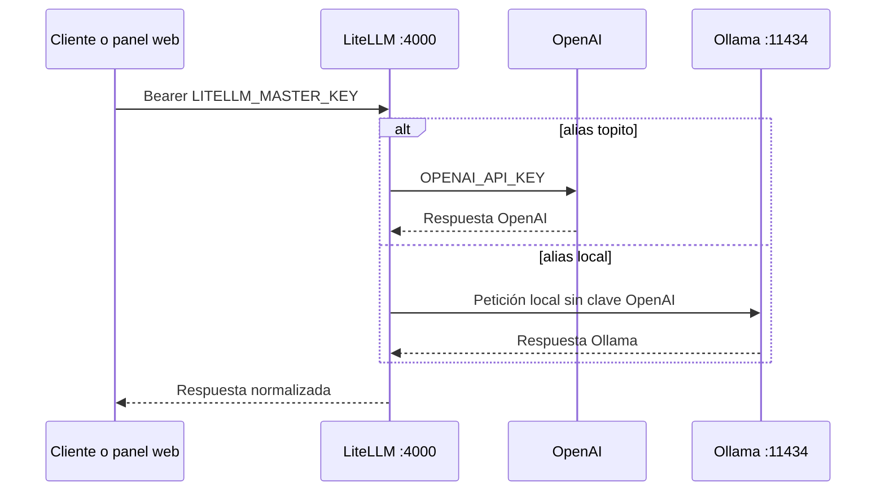

# IA Gateway · Guía técnica de la versión beta


IA Gateway convierte una configuración declarativa de LiteLLM en una experiencia
operable desde el navegador: arranque y parada reales, modelos activables,
pruebas inmediatas, observabilidad por petición y métricas de proceso. Todo se
ejecuta localmente y conserva una API compatible con OpenAI en el puerto `4000`.

> Estado del proyecto: la versión funcional anterior está congelada en el tag
> Git `alpha`. Este documento describe la evolución `beta`.

## Navegación rápida

- [Inicio en cinco minutos](#inicio-en-cinco-minutos)
- [Arquitectura](#2-arquitectura)
- [Instalación desde cero](#5-instalación-desde-cero)
- [Consumir el gateway](#6-consumir-el-gateway)
- [Observabilidad](#8-observabilidad)
- [Diagnóstico rápido](#12-diagnóstico-rápido)
- [Migrar desde Alpha](#14-migrar-desde-alpha)
- [Operación, respaldo y actualización](#15-operación-respaldo-y-actualización)

## Inicio en cinco minutos

Para quien ya tiene Python y Git instalados, este es el recorrido mínimo:

```bash
git clone http://nas.mole4.local:8418/smerchan/ia-gateway.git
cd ia-gateway
python3 -m venv .venv
source .venv/bin/activate
python -m pip install --upgrade pip
python -m pip install -r requirements.txt
cp .env.example .env
```

Edita `.env`, configura `OPENAI_API_KEY` y `LITELLM_MASTER_KEY`, revisa
`config.yaml` y arranca:

```bash
python app.py
```

Después abre <http://127.0.0.1:5100>, pulsa **Arrancar** y espera al indicador
`Activo · 127.0.0.1:4000`. El gateway estará disponible para clientes en
<http://127.0.0.1:4000/v1>.

## 1. Qué problema resuelve

LiteLLM es un gateway potente, pero operarlo únicamente desde terminal obliga a
combinar procesos, YAML, logs y herramientas de sistema. IA Gateway añade una
capa de control deliberadamente pequeña:

- un único lugar para arrancar y detener el proxy;
- una vista de salud que sólo dice «Activo» cuando el puerto responde;
- activación temporal de modelos sin destruir `config.yaml`;
- pruebas de chat y embeddings desde pestañas independientes;
- logs de entrada y salida, IPs, latencia inicial y duración total;
- métricas de CPU/RAM de LiteLLM y memoria de modelos Ollama;
- secretos fuera del repositorio mediante `.env`.

## 2. Arquitectura



### Dos puertos, dos responsabilidades

| Puerto | Servicio | Propósito |
|---:|---|---|
| `5100` | Panel FastAPI | Interfaz, control, pruebas y consulta de logs |
| `4000` | LiteLLM Proxy | Gateway consumido por aplicaciones y SDKs OpenAI |
| `11434` | Ollama | Inferencia local, si Ollama está instalado |

El panel nunca suplanta al gateway. Las aplicaciones siguen llamando al puerto
`4000`; el puerto `5100` sólo administra y observa.

### Dos saltos de autenticación



Las claves no son intercambiables:

| Credencial | Protege | Quién la usa | Modelos afectados |
|---|---|---|---|
| `LITELLM_MASTER_KEY` | Entrada al gateway `:4000` | Panel y clientes externos | Todos |
| `OPENAI_API_KEY` | Salida hacia la API de OpenAI | LiteLLM, internamente | Sólo aliases OpenAI |

Aunque un cliente solicite `topito`, debe autenticarse ante LiteLLM con
`LITELLM_MASTER_KEY`. LiteLLM añade después `OPENAI_API_KEY` al contactar con
OpenAI. En ningún caso debe enviarse la clave de OpenAI como token de entrada al
gateway.

## 3. Recorrido de una petición

1. Un cliente envía una petición compatible con OpenAI a LiteLLM.
2. LiteLLM busca el alias solicitado en `runtime/active_config.yaml`.
3. El proxy traduce la petición al proveedor OpenAI u Ollama.
4. El callback recibe inicio, primer resultado, final, metadatos y respuesta.
5. El callback oculta campos sensibles y escribe el evento en SQLite.
6. La web consulta SQLite y presenta el evento en la pestaña del modelo.

La zona «Prueba rápida» sigue exactamente el mismo camino. Por eso una prueba
hecha desde el panel también aparece en los logs y valida el sistema completo.

## 4. Estructura del repositorio

```text
ia-gateway/
├── app.py                         # API del panel y servidor web :5100
├── config.yaml                    # Fuente de verdad de modelos LiteLLM
├── .env                           # Secretos locales; nunca se versiona
├── .env.example                   # Plantilla segura de variables
├── requirements.txt               # Dependencias de producción fijadas
├── requirements-dev.txt           # Dependencias de desarrollo y tests
├── gateway/
│   ├── core.py                    # Ciclo de vida, salud y métricas
│   ├── litellm_callback.py        # Captura de llamadas y latencias
│   └── log_store.py               # Persistencia y migración SQLite
├── static/
│   ├── index.html                 # Estructura semántica del dashboard
│   ├── app.js                     # Estado y comportamiento del navegador
│   ├── style.css                  # Sistema visual beta
│   └── ia-gateway-beta-infografia.png # Cabecera visual de la web
├── tests/
│   ├── test_app.py                # Contrato HTTP y comportamiento web
│   └── test_core.py               # Configuración, logs y seguridad
├── docs/assets/
│   └── ia-gateway-beta-infografia.png
└── runtime/                       # Estado generado; excluido de Git
    ├── active_config.yaml         # Config LiteLLM filtrada
    ├── litellm_callback.py        # Copia importable junto al config
    ├── litellm.pid                # PID del supervisor
    ├── litellm-process.log        # stdout/stderr directo
    ├── requests.sqlite3           # Observabilidad estructurada
    └── state.json                 # Modelos temporalmente desactivados
```

### Regla de oro

Edita `config.yaml`, nunca `runtime/active_config.yaml`. El segundo se regenera
al arrancar LiteLLM o cambiar el estado de un modelo.

## 5. Instalación desde cero

### Dependencias y por qué existen

| Dependencia | Versión | Responsabilidad |
|---|---:|---|
| `litellm[proxy]` | `1.83.9` | Gateway compatible con OpenAI y normalización de proveedores. |
| `FastAPI` | `0.124.4` | API del panel y entrega de la interfaz web. |
| `Uvicorn` | `0.33.0` | Servidor ASGI que escucha en el puerto `5100`. |
| `httpx` | `0.28.1` | Comprobaciones de salud y llamadas de prueba a LiteLLM. |
| `psutil` | `>=6.1,<8` | CPU, memoria, árbol de procesos y puertos. |
| `PyYAML` | `>=6.0,<7` | Lectura y escritura segura de la configuración de modelos. |
| `python-dotenv` | `1.0.1` | Carga local de secretos desde `.env`. |
| `pytest` | `>=8.3,<9` | Pruebas automatizadas; solo se instala para desarrollo. |

Las versiones están acotadas para que dos instalaciones realizadas en momentos distintos produzcan un entorno reproducible.

### Requisitos

- macOS o Linux;
- Python 3.9 o posterior;
- acceso de red para proveedores remotos;
- Ollama opcional para los modelos locales;
- una API key y facturación API independiente si se usa OpenAI.

### Crear el entorno aislado

```bash
git clone <URL-DEL-REPOSITORIO> ia-gateway
cd ia-gateway

python3 -m venv .venv
source .venv/bin/activate
python -m pip install --upgrade pip
python -m pip install -r requirements.txt
```

### Configurar secretos

```bash
cp .env.example .env
```

Edita únicamente `.env`:

```dotenv
OPENAI_API_KEY=sk-tu-clave-real
LITELLM_MASTER_KEY=una-clave-general-larga-y-aleatoria
```

Puedes generar la clave general sin reutilizar ninguna credencial externa:

```bash
openssl rand -hex 32
```

`LITELLM_MASTER_KEY` autentica a todos los clientes que entran por el puerto
`4000`. `OPENAI_API_KEY` sólo se utiliza en el segundo salto, cuando LiteLLM
envía una petición del alias `topito` al proveedor OpenAI. Los modelos Ollama no
reciben la clave de OpenAI.

No pongas secretos en `config.yaml`, `active_config.yaml`, capturas, commits o
logs. `.env` ya está ignorado por Git.

### Configurar modelos

```yaml
model_list:
  - model_name: topito
    litellm_params:
      model: openai/gpt-5.6-sol
      api_key: os.environ/OPENAI_API_KEY
      reasoning_effort: high
      drop_params: true

  - model_name: embedding-local
    litellm_params:
      model: ollama/bge-m3:latest
      api_base: http://localhost:11434
      keep_alive: -1
      drop_params: true

general_settings:
  master_key: os.environ/LITELLM_MASTER_KEY
```

`model_name` es el alias estable que usan tus aplicaciones. El valor `model`
puede cambiar sin obligar a modificar los consumidores.

### Arrancar

```bash
source .venv/bin/activate
python app.py
```

Abre <http://127.0.0.1:5100>, pulsa **Arrancar** y espera a que el estado indique
`Activo · 127.0.0.1:4000`. El panel no declara el servicio activo hasta comprobar
que el puerto acepta conexiones.

## 6. Consumir el gateway

### cURL

```bash
curl http://127.0.0.1:4000/v1/chat/completions \
  -H 'Content-Type: application/json' \
  -H "Authorization: Bearer $LITELLM_MASTER_KEY" \
  -d '{
    "model": "topito",
    "messages": [{"role": "user", "content": "Escribe SELECT 1"}]
  }'
```

### SDK de OpenAI

```python
import os

from openai import OpenAI

client = OpenAI(
    base_url="http://127.0.0.1:4000/v1",
    api_key=os.environ["LITELLM_MASTER_KEY"],
)

response = client.chat.completions.create(
    model="topito",
    messages=[{"role": "user", "content": "Hola"}],
)
print(response.choices[0].message.content)
```

El SDK se denomina «OpenAI», pero cuando `base_url` apunta a LiteLLM su parámetro
`api_key` contiene la clave del gateway. No debe contener `OPENAI_API_KEY`.

### Qué hace la prueba del panel

El navegador envía únicamente el prompt y el alias a FastAPI en el puerto
`5100`. El backend lee `LITELLM_MASTER_KEY` desde su entorno y añade la cabecera
`Authorization` en la llamada interna al puerto `4000`. De esta forma:

- la clave general no aparece en HTML, JavaScript ni almacenamiento del navegador;
- chat y embeddings siguen exactamente la misma política;
- `topito` conserva su autenticación independiente hacia OpenAI;
- los modelos Ollama nunca reciben `OPENAI_API_KEY`.

## 7. API interna del panel

| Método | Ruta | Función |
|---|---|---|
| `GET` | `/api/status` | Salud, PID, puerto, CPU y RAM |
| `GET` | `/api/models` | Modelos y estado efectivo |
| `GET` | `/api/model-resources` | Recursos locales/remotos por modelo |
| `POST` | `/api/gateway/start` | Genera config y arranca LiteLLM |
| `POST` | `/api/gateway/stop` | Detiene el grupo de procesos |
| `PUT` | `/api/models/{name}/state` | Activa o desactiva un alias |
| `POST` | `/api/models/{name}/test` | Prueba chat o embeddings |
| `GET` | `/api/models/{name}/logs` | Eventos estructurados del modelo |
| `GET` | `/api/process-log` | Salida directa de LiteLLM |

Swagger está disponible en <http://127.0.0.1:5100/api/docs>.

## 8. Observabilidad

Cada evento nuevo conserva:

- timestamp de inicio, presentado en `Europe/Madrid`;
- alias de modelo y estado (`success` o `error`);
- IP de origen, respetando `X-Forwarded-For`;
- IP IPv4 resuelta del endpoint proveedor;
- tiempo hasta inicio de respuesta (`ttft_ms`);
- duración total (`duration_ms`);
- entrada y salida serializadas;
- excepción normalizada cuando la llamada falla.

En llamadas no streaming, LiteLLM puede entregar el primer resultado junto con
la respuesta completa; en ese caso TTFT y duración total serán iguales.

SQLite usa modo WAL para permitir que el callback escriba mientras la interfaz
consulta. Las migraciones son aditivas y se ejecutan al abrir la base, por lo que
los logs históricos no se destruyen.

## 9. Métricas y alcance

- **LiteLLM:** CPU normalizada sobre todos los cores y RSS del árbol de procesos.
- **Ollama:** CPU compartida del servicio, memoria del modelo y VRAM informadas
  por `/api/ps`. Cuando Ollama se ejecuta en el mismo servidor que el panel,
  también se muestra el porcentaje de RAM disponible del sistema.
- **OpenAI:** se marca como remoto; no es posible inspeccionar CPU/RAM del
  proveedor desde el equipo local. OpenAI tampoco expone mediante la API de
  inferencia un contador fiable de saldo o tokens restantes por modelo, por lo
  que el panel indica expresamente que ese dato no está disponible. Como señal
  operativa alternativa, al cargar la página se realiza una única petición
  mínima por modelo remoto y se muestra la latencia extremo a extremo.

El semáforo de latencia utiliza estos umbrales: verde por debajo de `2.000 ms`,
amarillo entre `2.000` y `5.000 ms`, y rojo por encima de `5.000 ms`. Es una
medición puntual que incluye el panel, LiteLLM, red, proveedor e inferencia; no
es un SLA ni una medida aislada de la red.

> Cada recarga completa de la página consume una petición mínima del proveedor
> remoto. El heartbeat de tres segundos no repite la sonda, por lo que dejar el
> panel abierto no genera llamadas adicionales.

No se presenta una precisión falsa: varios modelos Ollama pueden compartir el
mismo servidor y su CPU no es atribuible de forma fiable a una sola tarjeta.
Si `api_base` apunta a un Ollama remoto, el panel tampoco atribuye a ese host la
RAM libre de la máquina local; en ese caso presenta `—`.

## 10. Seguridad

El panel escucha sólo en `127.0.0.1`. Si se expone a una red, añade antes:

- autenticación fuerte;
- TLS mediante reverse proxy;
- una `master_key` de LiteLLM;
- control de acceso por red;
- política de retención de prompts y respuestas;
- redacción adicional para datos personales.

El logger oculta claves frecuentes (`authorization`, `api_key`, `token`,
`secret`), pero los prompts y respuestas pueden contener información sensible.

## 11. Desarrollo y pruebas

```bash
source .venv/bin/activate
python -m pip install -r requirements-dev.txt
PYTHONDONTWRITEBYTECODE=1 python -m pytest -q
```

Los tests cubren filtrado de modelos, preservación de `config.yaml`, redacción de
secretos, migraciones de metadatos, detección de embeddings, validación de
variables de entorno, contrato HTTP, anti-caché y pestañas de prueba.

## 12. Diagnóstico rápido

### «Proceso vivo, puerto sin servicio»

Consulta la pestaña **LiteLLM**. El panel diferencia el supervisor del endpoint:
un PID sin puerto operativo aparece como `Sin servicio`, nunca como activo.

### `401 Authentication Error: No api key passed in`

Es un rechazo de entrada de LiteLLM: falta `Authorization: Bearer
<LITELLM_MASTER_KEY>`. Si ocurre en la prueba web, confirma que `.env` contiene
`LITELLM_MASTER_KEY` y reinicia completamente `python app.py`. Si ocurre en un
cliente externo, configura esa clave como `api_key` del cliente que apunta a
`http://127.0.0.1:4000/v1`.

### `AuthenticationError` de OpenAI

Si LiteLLM acepta la llamada pero OpenAI rechaza `topito`, revisa
`OPENAI_API_KEY`, el proyecto al que pertenece y que `config.yaml` mantenga
`api_key: os.environ/OPENAI_API_KEY`. Esta credencial no arregla un `401` de
entrada al gateway.

### He cambiado `.env`, pero el error continúa

Las variables se cargan al iniciar la web y LiteLLM las hereda al arrancar.
Detén LiteLLM, termina `python app.py` con `Ctrl+C`, vuelve a iniciar la web y
pulsa **Arrancar**. Editar `.env` sin reiniciar no cambia procesos existentes.

### `RateLimitError: exceeded your current quota`

La cuota de ChatGPT Plus no incluye la API. Revisa saldo y facturación en la
plataforma API y verifica que la key pertenece al proyecto correcto.

### No aparecen IPs o latencias

Los registros anteriores a la migración no tienen esos campos. Detén y vuelve a
arrancar LiteLLM para cargar el callback actual, realiza una nueva petición y
fuerza una recarga del navegador si la webapp anterior seguía abierta.

### Ollama aparece «no cargado»

Significa que Ollama responde pero aún no mantiene ese modelo en memoria. Haz una
primera llamada; `keep_alive: -1` lo conservará cargado.

## 13. Versionado

```bash
# Volver exactamente a la versión funcional inicial
git switch --detach alpha

# Regresar a la línea actual
git switch main
```

`alpha` es la línea base funcional. `beta` añade documentación, enseñanza en el
código y una identidad visual más ambiciosa sin romper los contratos HTTP ni la
estructura operativa.

## 14. Migrar desde Alpha

Beta es una evolución compatible de Alpha: conserva sus puertos, endpoints,
modelo de configuración y directorio de ejecución. La migración no exige
convertir datos ni reescribir `config.yaml`.

### Qué conserva y qué mejora

| Área | Alpha | Beta |
|---|---|---|
| Panel | Control funcional | Misma estructura con sistema visual de alto contraste |
| Modelos | Activar y desactivar | Igual, con tipología y métricas más legibles |
| Pruebas | Chat y embeddings | Pestaña dedicada para cada modelo |
| Logs | Entradas y salidas | LiteLLM primero y pestañas por modelo con IPs y latencias |
| Estado | PID y puerto | Salud real, CPU total, RAM y recursos Ollama |
| Documentación | Puesta en marcha básica | Arquitectura, operación, seguridad, API y diagnóstico |
| Código | Funcional | Comentarios pedagógicos y responsabilidades explícitas |

### Actualización segura

```bash
cd ia-gateway
git status
git pull --no-rebase origin main
source .venv/bin/activate
python -m pip install -r requirements.txt
python -m pytest -q
python app.py
```

Antes del `pull`, `git status` debe estar limpio. Si contiene modificaciones
propias, crea un commit o guárdalas de forma consciente antes de actualizar.
Nunca copies `runtime/active_config.yaml` sobre `config.yaml`: el primero es una
salida generada y puede omitir modelos desactivados.

### Volver temporalmente a Alpha

```bash
git switch --detach alpha
source .venv/bin/activate
python -m pip install -r requirements.txt
python app.py
```

Para regresar a Beta:

```bash
git switch main
```

El modo `detach` es apropiado para inspección o diagnóstico. No desarrolles
cambios permanentes ahí sin crear antes una rama.

## 15. Operación, respaldo y actualización

### Secuencia diaria recomendada

1. Arranca la web con `python app.py`.
2. Abre el panel en el puerto `5100`.
3. Pulsa **Arrancar** para iniciar LiteLLM.
4. Comprueba puerto, PID, CPU y RAM en la cabecera.
5. Ejecuta una prueba desde la pestaña del modelo que vas a consumir.
6. Verifica la nueva entrada en **Actividad**.
7. Antes de cerrar la web, pulsa **Detener** para terminar LiteLLM limpiamente.

### Qué debe respaldarse

| Elemento | ¿Respaldar? | Motivo |
|---|---:|---|
| `config.yaml` | Sí | Fuente de verdad de los modelos |
| `.env` | Sí, en un gestor seguro | Contiene secretos y no está en Git |
| `runtime/requests.sqlite3` | Opcional | Histórico de solicitudes y respuestas |
| `runtime/state.json` | Opcional | Modelos desactivados temporalmente |
| `runtime/active_config.yaml` | No | Se regenera automáticamente |
| `runtime/litellm.pid` | No | Sólo tiene sentido durante la ejecución |
| `runtime/litellm-process.log` | Opcional | Útil para auditoría y diagnóstico |

Para respaldar SQLite mientras la aplicación está detenida:

```bash
mkdir -p backups
cp runtime/requests.sqlite3 backups/requests.sqlite3
```

No publiques ese respaldo: puede contener prompts, respuestas, direcciones IP y
otros datos sensibles.

### Actualizar dependencias

Las versiones de producción están controladas en `requirements.txt`. Una
actualización responsable debe realizarse en una rama, seguida de:

```bash
source .venv/bin/activate
python -m pip install -r requirements.txt
python -m pytest -q
```

Además de los tests, valida manualmente un chat OpenAI, un embedding Ollama, la
parada del proxy y la escritura de un evento en cada pestaña de logs.

### Detención de emergencia

Usa primero el botón **Detener**. Si el navegador no responde, interrumpe
`python app.py` con `Ctrl+C`. Al reiniciar, el gestor valida el PID guardado y el
puerto; no confía ciegamente en un fichero PID antiguo.

## 16. Decisiones de diseño

- **FastAPI sin framework frontend:** reduce dependencias y hace el panel fácil
  de auditar, desplegar y enseñar.
- **Configuración generada:** permite desactivar modelos sin modificar la fuente
  de verdad del usuario.
- **SQLite en modo WAL:** ofrece persistencia local y lecturas concurrentes sin
  desplegar una base de datos externa.
- **PID más comprobación de puerto:** un proceso vivo no garantiza un servicio
  operativo; ambos indicadores son necesarios.
- **Reloj monotónico para latencias:** evita errores si cambia la hora del sistema
  durante una petición.
- **Métricas honestas:** los recursos remotos de OpenAI no se inventan y la CPU
  compartida de Ollama se identifica como tal.
- **Interfaz servida por la propia API:** una sola orden arranca toda la capa de
  control y evita una cadena de compilación adicional.

## 17. Lista de aceptación de una instalación

Una instalación Beta puede considerarse correcta cuando se cumplen todos estos
puntos:

- [ ] El panel abre en `127.0.0.1:5100` sin errores de consola.
- [ ] **Arrancar** cambia a **Detener** sólo cuando responde el puerto `4000`.
- [ ] La cabecera muestra PID, CPU total y memoria RAM.
- [ ] Todos los alias de `config.yaml` aparecen en la zona de modelos.
- [ ] Desactivar un modelo no modifica el fichero `config.yaml` original.
- [ ] Las pestañas de prueba distinguen chat de embeddings.
- [ ] Una llamada OpenAI usa la clave de `.env`, nunca una clave versionada.
- [ ] Una llamada sin `LITELLM_MASTER_KEY` al puerto `4000` recibe `401`.
- [ ] Una llamada con `LITELLM_MASTER_KEY` funciona para OpenAI y Ollama.
- [ ] La prueba web funciona sin exponer la clave general en el navegador.
- [ ] Una llamada Ollama llega a `localhost:11434`.
- [ ] La pestaña LiteLLM presenta la salida directa del proceso.
- [ ] Los eventos nuevos muestran hora de Madrid, IPs y latencias disponibles.
- [ ] `python -m pytest -q` termina sin fallos.

Con esta lista superada, la aplicación no sólo “arranca”: queda validada de
extremo a extremo, desde la configuración hasta la trazabilidad de la respuesta.
