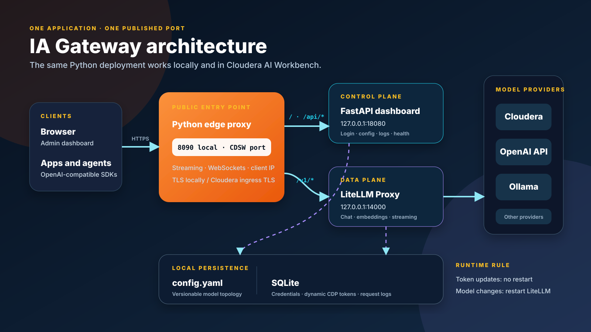
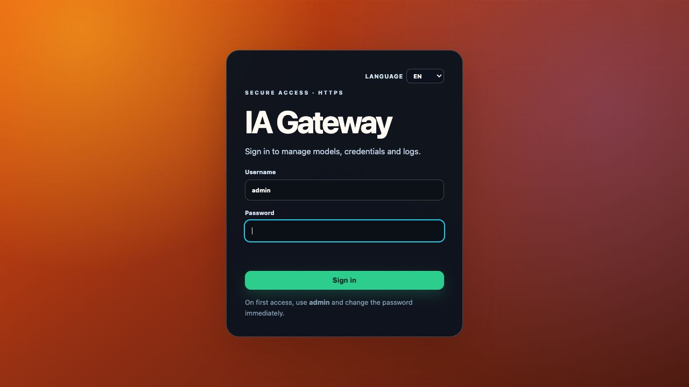
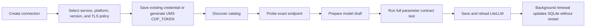
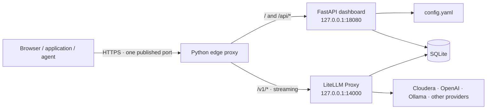
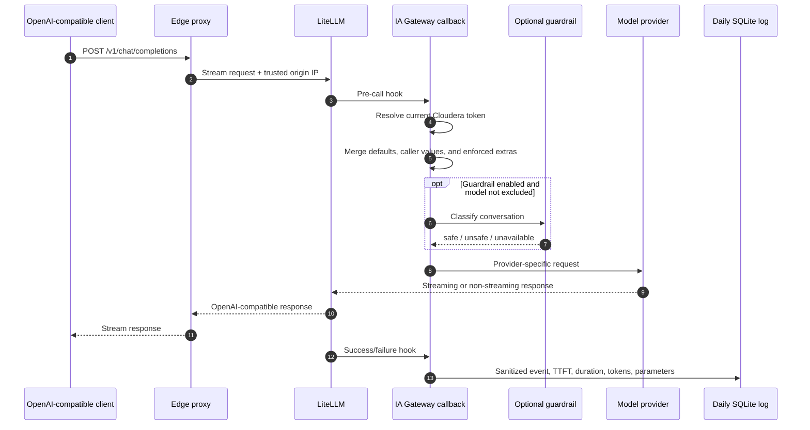

# IA Gateway

IA Gateway is a lightweight control plane for [LiteLLM](https://docs.litellm.ai/). It exposes one OpenAI-compatible public endpoint while providing a browser dashboard for model discovery, configuration, guardrails, health checks, tests, metrics, and request logs.

The same Python application runs locally and as a Cloudera AI Workbench application. It does not require Docker, Nginx, PostgreSQL, or an external database.

> **One URL. Every model. No silent token expiry.** IA Gateway combines model routing, renewable Cloudera credentials, pre-flight validation, controlled load testing, and operational evidence in a single self-contained service.

[](#local-installation)
[](https://docs.litellm.ai/)
[](#interface-languages)
[](#persistence-and-restart-rules)
[](#run-tests)



## Documentation map

| If you want to… | Start here |
|---|---|
| Run the project for the first time | [Five-minute start](#five-minute-start) |
| Understand every dashboard section | [User manual](#1-user-manual) |
| Install it in Cloudera | [Cloudera AI installation](#cloudera-ai-installation) |
| Understand processes, data, and files | [Architecture](#2-architecture) |
| Compare Cloudera, OpenAI, Ollama, NIM, vLLM, Triton, and Workbench | [Provider and environment differences](#3-provider-and-environment-differences) |
| Diagnose a failure | [Troubleshooting playbook](#troubleshooting-playbook) |
| Operate or extend the code | [Operations](#operations) and [Source map](#source-map) |

## What it provides

- One published port for both the dashboard and the OpenAI-compatible API.
- A Python streaming proxy based on `aiohttp`; no Nginx dependency.
- LiteLLM lifecycle management from the dashboard.
- Guided model CRUD plus an advanced `config.yaml` editor.
- YAML validation, download backup, and validated import/restore.
- OpenAI-compatible, Ollama, Cloudera AI Inference, and Cloudera AI Workbench models.
- Optional pre-request guardrail using any configured chat model supported by LiteLLM.
- Cloudera model discovery, endpoint probing, and token generation/renewal.
- SQLite-only persistence for Cloudera credentials, dynamic tokens, and structured request logs.
- Daily KPIs, hourly activity, origin/provider IPs, TTFT, duration, tokens, and Excel export.
- Controlled load batteries with stepped concurrency, real TTFT percentiles, correctness checks, live charts, cancellation, and JSON reports.
- Spanish, English, and Italian dashboard languages, persisted per browser.
- Built-in administrator login with forced password change on first access.

## 1. User manual

### Five-minute start

1. Start the application with `python3 app.py` locally, or configure `app.py` as the Cloudera application launcher.
2. Open the published URL. Locally, use `https://127.0.0.1:8090`.
3. Sign in with `admin` / `admin` and replace the initial password immediately.
4. Open **Configuration** and add a provider connection or model.
5. Run the model's real parameter test. IA Gateway will not mark a new or changed model ready until its exact configuration has passed.
6. Apply the pending LiteLLM restart, open **Models**, and send a Quick test.
7. Use **Load testing** to find an initial sustainable concurrency level, then use **Logs** to review latency, TTFT, errors, tokens, effective parameters, and guardrail decisions.



The screenshot above is generated from the running application. The language selector is available before authentication, so every administrator can choose a language before entering credentials.

### Dashboard tour

| Section | What it answers | Main actions |
|---|---|---|
| **Models** | Which aliases are active and healthy? What capacity is visible? | Start/stop LiteLLM, enable/disable aliases, inspect health and memory, run chat or embedding probes |
| **Configuration** | How is every route, credential, guardrail, fallback, and parameter defined? | Guided CRUD, Cloudera discovery, TLS policy, credential renewal, advisor, backup/restore, advanced YAML |
| **Load testing** | How much concurrent traffic can the gateway and each backend sustain? | Select up to eight models, ramp concurrency from 1 to N, choose request/time budget, warm up, monitor live charts, export JSON |
| **Logs** | What happened on every request and how did the service behave over a day? | View KPIs and request detail, inspect sanitized effective parameters and IPs, export Excel, inspect LiteLLM technical logs |

### Models

The inventory is the operational home page. A model card distinguishes the public alias from the provider model, displays whether it is chat or embeddings, and separates process state from endpoint health. Remote CPU or VRAM values are never fabricated: unavailable remote metrics are labelled as such.

Use **Quick test** for a real end-to-end request through the same public alias used by clients. Chat aliases receive a user message; embedding aliases receive text and must return a non-empty vector. This is different from the pre-save contract test: Quick test verifies the currently loaded router, while the contract test validates a candidate configuration before it is allowed into that router.

Disabling an alias changes runtime state without deleting its YAML definition. Adding, editing, deleting, or changing topology requires a LiteLLM restart; credential renewal does not.

### Configuration

The guided editor groups values by responsibility:

- **Identity and transport:** alias, provider model, API base, and environment-variable reference.
- **Capacity:** context window, maximum output capacity, request timeout, retries, and router concurrency.
- **Generation:** temperature, Top P, Top K, Min P, penalties, seed, stop sequences, and reasoning controls.
- **Precedence:** either caller values override model defaults, or the model enforces its configured values on every call.
- **Extras:** typed `VARIABLE=VALUE` entries for provider-specific fields, including dotted nested keys.
- **Resilience and safety:** fallbacks, optional guardrail, per-model guardrail exclusions, and the optional configuration advisor.

Every new or materially changed model must pass a live parameter test before it can be saved. The proof is bound to the exact configuration, expires quickly, and cannot be reused after a parameter changes. This prevents a syntactically valid YAML file from advertising a model that the provider will reject.

The advanced editor remains the source-of-truth escape hatch. It validates structure, duplicate aliases, references, and environment variables, and it preserves manual YAML formatting. Backup download never expands secrets. Import validates first and replaces atomically only after approval.

### Cloudera connection workflow



The endpoint/catalog URL and IAM/Control Plane URL are different concepts. The first discovers and calls models; the second generates renewable UMS workload tokens. TLS trust is connection-scoped and is reused consistently by IAM calls, catalog discovery, model probes, validation, and the live LiteLLM client.

### Guardrail and advisor

The guardrail is an optional request-time classifier. In permissive mode it records risk and continues; in restricted mode it blocks unsafe input. Embedding models are excluded automatically, and any chat alias can also be excluded explicitly. The guardrail model itself is selected globally in Configuration.

The advisor is separate: it asks a selected chat model to recommend capacity and generation values for a described use case. Its response is treated as untrusted input. A user must review and apply it, save the model, and still pass the real provider test. A model that works as an OpenAI advisor may fail through a Workbench wrapper when that wrapper rejects the generated request shape; the error is surfaced rather than silently changing the requested parameters.

### Load testing

Concurrency always ramps through every level from `1` to the selected maximum. A maximum of `5` therefore measures five distinct stages, not five permanent workers. Choose either a request budget or a time budget—up to `100,000` seconds per model—and either run models in parallel to stress the whole gateway or sequentially to isolate backend capacity.

The live view reports in-flight requests, throughput, error rate, correctness, TTFT and total latency percentiles, per-stage degradation, and an estimated sustainable concurrency. Chat cases are deterministic and automatically scored; embedding cases verify numeric vectors. Reports can be stopped cooperatively and downloaded as JSON.

### Logs

Structured logs are stored per day and model. They include timestamps, public alias, origin/provider IP, status, TTFT, total duration, token usage, guardrail result, and sanitized effective parameters after precedence rules. API keys, authorization headers, and routing secrets are redacted. The daily view provides KPIs, an hourly histogram, request detail, and Excel export. A separate LiteLLM tab exposes stdout/stderr for startup and provider diagnostics.

### Interface languages

The dashboard is available in Spanish, English, and Italian. The choice is stored locally in the browser and applies to static labels, accessibility attributes, modal content, and dynamic status messages. Backend/provider payloads are preserved verbatim inside diagnostic details so that vendor support can recognize the original error.

## 2. Architecture



The public listener routes by path:

| Public path | Internal target | Purpose |
|---|---|---|
| `/`, `/static/*`, `/api/*` | FastAPI on `127.0.0.1:18080` | Dashboard, authentication, configuration, discovery, and logs |
| `/v1/*` | LiteLLM on `127.0.0.1:14000` | OpenAI-compatible inference, including streaming |

Only the edge port is published. The dashboard and LiteLLM ports remain on loopback and are not exposed externally.

### Port selection

| Process | Environment variable | Local default |
|---|---|---:|
| Public Python edge proxy | `IA_GATEWAY_PORT`; otherwise the first defined value of `CDSW_READONLY_PORT`, `CDSW_APP_PORT`, or `CDSW_PUBLIC_PORT` | `8090` |
| Internal FastAPI dashboard | `IA_GATEWAY_DASHBOARD_PORT` | `18080` |
| Internal LiteLLM Proxy | `IA_GATEWAY_LITELLM_PORT` | `14000` |

In Cloudera, the platform terminates TLS and forwards traffic to its assigned application port. Locally, IA Gateway creates a self-signed development certificate and serves HTTPS on `8090` by default.

### Persistence and restart rules

| Data | Storage | Restart needed? |
|---|---|---|
| Model topology, aliases, fallbacks, and guardrail selection | `config.yaml` | Yes, LiteLLM must reload its routing table |
| Cloudera connections and secrets | `runtime/cloudera.sqlite3` | No |
| Renewed CDP tokens and model-specific tokens | `runtime/cloudera.sqlite3` | No; the LiteLLM callback reads the current value dynamically |
| Structured request logs | SQLite files under `runtime/` | No |
| Effective LiteLLM configuration | `runtime/active_config.yaml` | Generated automatically; do not edit |

SQLite is part of the Python standard library. There is no database server to install or operate.

### Logical request lifecycle



### File and ownership architecture

```text
ia-gateway/
├── app.py                         # Bootstrap, FastAPI API, schemas, lifecycle
├── config.yaml                    # Versionable source of truth for model topology
├── gateway/
│   ├── auth.py                    # Argon2id admin credentials, sessions, CSRF
│   ├── benchmark.py               # Bounded stepped-concurrency engine
│   ├── cloudera.py                # Discovery, TLS policy, SQLite secrets, renewal
│   ├── core.py                    # YAML transactions and LiteLLM supervision
│   ├── edge.py                    # Public proxy process lifecycle
│   ├── edge_server.py             # Streaming path router and trusted client IP
│   ├── excel_export.py            # Dependency-free XLSX generation
│   ├── litellm_callback.py        # Dynamic credentials, guardrail, observability
│   ├── litellm_sitecustomize.py   # Early host-scoped TLS setup for LiteLLM
│   ├── log_store.py               # Daily SQLite request logs and KPIs
│   ├── tls.py                     # Local development certificate generation
│   └── workbench_provider.py      # LiteLLM adapter for Workbench /model wrappers
├── static/
│   ├── index.html                 # Accessible SPA structure
│   ├── app.js                     # Dashboard state, rendering, and API calls
│   ├── i18n.js                    # ES/EN/IT static and dynamic translations
│   └── style.css                  # Responsive design system
├── deployments/                   # Example Cloudera model deployment code
├── tests/                         # Unit and HTTP contract tests
├── docs/screenshots/              # README captures from the running UI
└── runtime/                       # Generated/private state; ignored by Git
    ├── active_config.yaml         # Sanitized effective LiteLLM configuration
    ├── cloudera.sqlite3           # Connections, secrets, lifecycle state
    ├── logs/YYYY-MM-DD.sqlite3    # Structured request events
    ├── edge/edge.log              # Public proxy technical log
    └── tls/                       # Local certificate and private key
```

Ownership is intentional: `config.yaml` describes stable routing, SQLite holds mutable private state, and `runtime/active_config.yaml` is generated. Editing generated runtime files bypasses validation and is unsupported.

## Cloudera AI installation

### 1. Download the project from GitHub

From a Cloudera project terminal:

```bash
git clone https://github.com/smerchanmole/AI-gateway.git
cd AI-gateway
```

If the project is already cloned and `config.yaml` contains local dashboard changes, preserve it before pulling:

```bash
git stash push -m "local IA Gateway config" -- config.yaml
git pull origin main
git stash pop
```

Alternatively, download a YAML backup from **Configuration → Export or restore config.yaml**, pull the repository, and import the backup afterward.

### 2. Create the Cloudera application

Create a Cloudera AI Workbench application with:

- **Launcher:** `app.py`
- **Platform authentication:** disabled, if clients must call `/v1/*` directly without a Cloudera browser session
- **Runtime:** Python 3.11 or newer
- **Port:** let Cloudera inject the assigned `CDSW_*_PORT`

`app.py` creates a private `.venv`, installs `requirements.txt`, validates it with `pip check`, and starts the application. The first launch therefore takes longer and requires access to the configured Python package index.

Disabling Cloudera platform authentication exposes the application URL to the network policy applied to that workspace. The dashboard still has its own administrator login. The `/v1/*` inference API currently does not require the dashboard password or a LiteLLM master key, so protect the URL with the appropriate Cloudera/network access policy before production use.

### 3. Sign in and change the initial password

Open the application URL and use:

```text
username: admin
password: admin
```

The dashboard forces a password change before allowing access. Use at least 12 characters with uppercase, lowercase, a number, and a symbol.

### 4. Register at least one Cloudera connection

Open **Configuration → Cloudera**. Two different URLs are involved:

1. **Base URL** is the origin that hosts Model Endpoints and the discovery API. You may paste a full endpoint URL; IA Gateway keeps only the scheme and domain.
2. **Renewal URL** is the IAM or Knox endpoint used to generate/renew the CDP workload token.

#### Cloudera Cloud example

| Field | Example |
|---|---|
| Service | `Cloudera AI Inference` |
| Deployment | `Cloud` |
| Full model endpoint URL | `https://ml-64288d82-5dd.go01-dem.ylcu-atmi.cloudera.site/namespaces/serving-default/endpoints/my-model/v1` |
| Base URL entered in the form | `https://ml-64288d82-5dd.go01-dem.ylcu-atmi.cloudera.site` |
| Discovery API used by IA Gateway | `https://ml-64288d82-5dd.go01-dem.ylcu-atmi.cloudera.site/api/v1alpha1/listEndpoints` |
| Renewal URL | `https://iamapi.us-west-1.altus.cloudera.com` |
| Workload name | for example `DE` |
| Credentials | `CDP_ACCESS_KEY_ID` and `CDP_PRIVATE_KEY` from a CDP machine user/API access key |

Do not use `https://console.cdp.cloudera.com` as the Base URL. The historic `altus.cloudera.com` IAM hostname is intentional; `iamapi.us-west-1.cdp.cloudera.com` does not resolve.

The Cloudera application runtime must have outbound DNS and HTTPS access to both the Model Endpoint domain and the IAM hostname. A DNS failure cannot be fixed by application code; the workspace egress policy must allow it.

#### Cloudera on-premises example

The on-premises form covers both **Cloudera AI Inference** and direct **Cloudera AI Workbench Model Service** deployments. Select both the Cloudera AI service pack and the exact CDP Base Runtime so the dashboard can enforce Cloudera's compatibility matrix for AI Inference:

| Cloudera AI | Supported Runtime selections |
|---|---|
| 1.5.5 SP2 | 7.1.9 SP1, 7.3.1 |
| 1.5.5 SP2 CHF1 | 7.1.9 SP1, 7.3.1, 7.3.2 |
| 1.5.5 SP3 | 7.1.9 SP2, 7.3.1, 7.3.2 |

| Field | Example |
|---|---|
| Service | `Cloudera AI Inference` |
| Deployment | `On-premise` |
| Full model endpoint URL | `https://ml.company.example/namespaces/serving-default/endpoints/my-model/openai/v1` |
| Base URL entered in the form | `https://ml.company.example` |
| Discovery API used by IA Gateway | `https://ml.company.example/api/v1alpha1/listEndpoints` for AI Inference |
| Automatic CDP token URL | Management Console/Control Plane origin, for example `https://console-cdp.apps.company.example` |
| Automatic credentials | `CDP_ACCESS_KEY_ID` and `CDP_PRIVATE_KEY` from a user or least-privilege machine user, plus workload name such as `DE` |

The on-premises panel offers two deliberately separate modes:

1. **Existing credential** accepts a UMS `CDP_TOKEN`, copied from Model Endpoint Details or produced by `cdp iam generate-workload-auth-token --workload-name DE`. A Knox API key is also accepted only for Cloudera AI 1.5.5 SP3 with Runtime 7.1.9 SP2 or 7.3.2, the combinations certified by Cloudera.
2. **Automatic UMS `CDP_TOKEN`** uses the private Management Console origin. CDP CLI builds the `/api/v1/iam/generateWorkloadAuthToken` operation, signs it with the access key/private key, generates the first token immediately, and replaces it early without restarting LiteLLM.

Private Control Planes often use a corporate or self-signed CA that is not present in the WebApp container. For those connections select **Private CA (PEM)** and paste the root CA plus any intermediate certificates; IA Gateway stores the bundle locally, invokes CDP CLI with `--ca-bundle`, and reuses the same trust policy for IAM, catalogue discovery, model probes, validation, and the live LiteLLM/OpenAI client. The latter installs a verified SSL context inside LiteLLM because its shared `aiohttp` client does not inherit a per-deployment CA path in every code path. Public roots, certificate dates, and hostname checks remain enabled. Trusting the certificate in a workstation browser does not install it in the Cloudera WebApp. **Do not verify (insecure)** is available only for short diagnostic tests and should not be used for automatic renewal in production.

A general platform username/password is **not** a documented non-interactive credential for `iam generate-workload-auth-token`. A Basic-authenticated Knox token endpoint issues a different service JWT and must not be presented as a UMS `CDP_TOKEN`; consequently this CAI Inference form does not offer that misleading combination.

`cdp iam set-authentication-policy --workload-auth-token-expiration-sec ...` only changes the account-wide lifetime applied when UMS issues future tokens; it does not create or refresh one. IA Gateway therefore does not need to lengthen tokens to 90 days: it calls `generate-workload-auth-token` again inside the early-renewal window and atomically replaces the current value. Changing the global policy remains an explicit administrator decision because longer JWTs cannot be revoked individually.

Do not paste the interactive page ending in `/token-generation/index.html`, a Knox route, or a generic Knox Gateway JWT whose Target Base URL is `/gateway/cdp-proxy-token` into the IAM URL field. AI Inference expects a UMS CDP JWT or its specifically configured Knox API key support.

Knox API keys require an administrator to configure `cdp-preauth` in `conf/cdp-resources.xml` for the Data Lake Knox Gateway Default Group, refresh stale Knox configurations, and verify the topology in Knox Admin UI. If a UMS JWT works but a Knox API key returns HTTP 401, verify this prerequisite and that the complete generated key—not its identifier—was copied.

Credential lifecycle is always reported explicitly. JWT expiry is read from the `exp` claim. UMS tokens are regenerated in advance when all IAM generation fields are present. The default lead is up to seven days but capped at 25% of token lifetime, so a normal one-hour UMS token rotates roughly 15 minutes early; `CDP_RENEWAL_LEAD_SECONDS` can lower that maximum. The supervisor retries every minute and the LiteLLM callback reads the replacement atomically from SQLite on every request.

Opaque Knox API keys do not expose an expiry claim and cannot be regenerated by IA Gateway. Enter their administrative expiry date (for example, 90 days) so the dashboard calculates an advance rotation date. For uninterrupted operation, prefer the renewable UMS flow. If a model-specific JWT expires while the connection has a valid renewed CDP token, IA Gateway automatically falls back to the connection credential.

You can either paste an existing CAI credential or select automatic UMS generation and leave the token blank. IA Gateway then requests the initial token and subsequently replaces it in the background. Secret values are stored in SQLite with file mode `0600` and are never returned to the browser.

#### Direct Workbench endpoints, including embeddings

Workbench Model Service uses credentials that must not be confused with AI Inference authentication. Cloudera documents the per-model identifier under [Access Keys for Models](https://docs.cloudera.com/machine-learning/cloud/models/topics/ml-model-access-key.html) and the user credential separately under [Cloudera AI API v2](https://docs.cloudera.com/machine-learning/latest/api/topics/ml-api-v2.html):

| Value | Purpose | Where it comes from |
|---|---|---|
| Model `accessKey` | Selects and grants access to one deployed model | Model deployment page or its generated cURL |
| Workbench user API key | Optional `Authorization: Bearer` authentication when model authentication is enabled | **User Settings → API Keys** in that Workbench |
| CDP access key ID/private key | Signs Control Plane IAM operations | CDP user or machine user; it does **not** replace a Workbench API key |

Choose **Cloudera AI Workbench**, paste the complete `https://modelservice.../model` URL, select **Chat / generation** or **Embeddings**, and paste the model `accessKey`. A copied URL containing `?accessKey=...` is accepted: IA Gateway removes the query secret from the stored/public URL and keeps it only in the local credential store. If the deployment requires bearer authentication, also enter the optional Workbench user API key. Private CA and diagnostic no-verification modes are available per connection.

For an embedding deployment, IA Gateway exposes the normal LiteLLM/OpenAI `/v1/embeddings` route and translates it to the Workbench body:

```json
{
  "accessKey": "<stored-model-access-key>",
  "request": {
    "input": ["first document", "second document"],
    "input_type": "passage",
    "normalize": true,
    "batch_size": 2
  }
}
```

The discovery card offers separate `query` and `passage` drafts, so an asymmetric embedding model can be registered with two LiteLLM aliases while sharing the same deployment. Chat deployments continue to use `request.messages`; automatic retries are disabled in the active LiteLLM configuration to avoid leaving overlapping requests on a busy Workbench replica.

### 5. Discover and add models

1. Save the Cloudera connection.
2. Select **Discover models**.
3. Review deployment state, credential state, endpoint URL, and protocol compatibility.
4. Use **Test access** to validate the endpoint and credential.
5. Select **Prepare draft** on each required model.
6. Review the LiteLLM name, API base, and credential reference.
7. Select **Add model** and apply the pending LiteLLM restart.

A newly added model requires a LiteLLM restart because LiteLLM must rebuild its router. Token generation and renewal do not require a restart.

AI Gateway reports the HTTP protocol separately from the serving stack. An endpoint can therefore be OpenAI-compatible while running NVIDIA NIM, vLLM, or Triton underneath. For asymmetric NVIDIA NIM embedding models, discovery exposes two explicit drafts: `-query` for user questions and `-passage` for document ingestion. Configure both aliases when the RAG client can select them independently; using the query role to index documents can materially reduce retrieval quality. Triton/KServe v2 endpoints are checked through their readiness route until a tensor schema-specific adapter is configured.

### 6. Configure an optional guardrail

In **Configuration → Optional pre-request guardrail**:

1. Choose any configured chat model that can classify the conversation. It may be hosted by Ollama, Cloudera, OpenAI, or another OpenAI-compatible provider.
2. Enable **Apply before chat models**.
3. Choose a policy:
   - **Permissive:** record a warning and continue to the requested model.
   - **Restricted:** block the request when the guardrail marks it unsafe.
4. Under **Do not apply guardrail to**, select any chat aliases that must bypass classification.

Embedding requests are always excluded automatically: they carry vector inputs rather than a chat conversation and do not benefit from the current conversational classifier. Explicit exclusions are preserved when an alias is renamed and removed when that model is deleted. The guardrail model must return a classification that IA Gateway can interpret. Llama Guard models are a natural fit, but the transport is provider-independent.

## Local installation

Requirements:

- Python 3.11 or newer
- Internet or an internal Python package mirror on first launch
- Optional: Ollama, if local Ollama models are configured

```bash
git clone https://github.com/smerchanmole/AI-gateway.git
cd AI-gateway
python3 app.py
```

The bootstrap creates `.venv` and installs dependencies automatically. Then open:

```text
https://127.0.0.1:8090
```

The certificate is self-signed for local development, so the browser or `curl` needs an explicit exception. You may also prepare the environment manually:

```bash
python3 -m venv .venv
source .venv/bin/activate
pip install -r requirements.txt
python app.py
```

Optional `.env` example:

```dotenv
OPENAI_API_KEY=sk-your-key
IA_GATEWAY_PORT=8090
IA_GATEWAY_DASHBOARD_PORT=18080
IA_GATEWAY_LITELLM_PORT=14000
CDP_RENEWAL_TIMEOUT_SECONDS=60
```

The three ports must be distinct. Only `IA_GATEWAY_PORT` is externally accessible.

## Calling the API

### List models

Local:

```bash
curl -k https://127.0.0.1:8090/v1/models
```

Cloudera:

```bash
curl https://your-app.your-workspace.cloudera.site/v1/models
```

### Chat completion

```bash
curl -k https://127.0.0.1:8090/v1/chat/completions \
  -H 'Content-Type: application/json' \
  -d '{
    "model": "your-model-alias",
    "messages": [{"role": "user", "content": "Hello, how are you?"}],
    "stream": false
  }'
```

For Cloudera, replace the local URL and remove `-k`:

```bash
curl https://your-app.your-workspace.cloudera.site/v1/chat/completions \
  -H 'Content-Type: application/json' \
  -d '{"model":"your-model-alias","messages":[{"role":"user","content":"Hello"}]}'
```

### Streaming

```bash
curl -k -N https://127.0.0.1:8090/v1/chat/completions \
  -H 'Content-Type: application/json' \
  -d '{
    "model": "your-model-alias",
    "messages": [{"role": "user", "content": "Explain SQLite briefly."}],
    "stream": true
  }'
```

### Multimodal requests

Multimodal payloads pass through the same `/v1/chat/completions` route. They work when LiteLLM supports the provider/model combination and the target model accepts images:

```bash
curl -k https://127.0.0.1:8090/v1/chat/completions \
  -H 'Content-Type: application/json' \
  -d '{
    "model": "your-vision-alias",
    "messages": [{
      "role": "user",
      "content": [
        {"type": "text", "text": "Describe this image"},
        {"type": "image_url", "image_url": {"url": "https://example.com/image.jpg"}}
      ]
    }]
  }'
```

The public proxy accepts streaming request bodies and responses and allows payloads up to 100 MiB. Base64 images increase request size significantly; hosted URLs are usually more efficient.

## Model configuration

`config.yaml` is the versionable source of truth. A minimal example is:

```yaml
model_list:
  - model_name: my-model
    litellm_params:
      model: openai/provider/model-id
      api_base: https://provider.example/v1
      api_key: os.environ/PROVIDER_API_KEY
      drop_params: true

dashboard_settings:
  guardrail:
    enabled: false
    model: ""
    policy: warn
    timeout: 8
    excluded_models: []

router_settings: {}
```

Never put a secret value directly in `config.yaml`. Use an environment reference such as `os.environ/OPENAI_API_KEY`, or use the Cloudera credential form so the value is stored in SQLite.

The advanced editor validates YAML structure, duplicate aliases, fallbacks, guardrail references, and environment references before saving. Export/import is available at the bottom of the Configuration page. Imports are validated before atomically replacing the configuration.

### Per-model capacity and generation profiles

The guided editor separates parameters by responsibility so a request option is not confused with a deployment limit:

| Group | Stored as | Purpose |
|---|---|---|
| Total context window and maximum output capacity | `model_info.max_input_tokens` / `max_output_tokens` plus dashboard metadata | Declares the capacity LiteLLM should use for routing. It does not increase a vLLM `--max-model-len`, NIM engine limit, or Triton model configuration. |
| Default output, temperature, Top P, penalties, seed and stop sequences | `litellm_params` | Default OpenAI-compatible generation behaviour for this deployment. |
| Top K, Min P and repetition penalty | `litellm_params.extra_body` | Provider extensions used only by vLLM, NIM, Ollama and the Workbench adapter. |
| Reasoning mode | standard `reasoning_effort`, plus backend-specific `extra_body` | Workbench receives `enable_thinking`; vLLM/NIM receive `chat_template_kwargs.enable_thinking`. Unsupported backends do not receive this extension. |
| Timeout, retries and maximum parallel requests | `litellm_params` | Operational protection and per-deployment router concurrency. The Workbench-oriented presets use zero retries to avoid overlapping requests leaving a replica busy. |

The `Cloudera AI 1.5.5 SP3` compatibility profile enforces the current Workbench adapter's safe default-output ceiling of 512 tokens. This ceiling is intentionally separate from the model's declared context capacity. The raw Triton OIP profile rejects OpenAI generation controls because tensor shapes, batching, scheduling, warmup and TensorRT-LLM engine limits belong to the Cloudera deployment or Triton `config.pbtxt`.

Example generated profile for a Qwen model served by vLLM:

```yaml
model_list:
  - model_name: qwen-reasoning
    litellm_params:
      model: openai/Qwen/Qwen3-32B
      api_base: https://inference.example/v1
      api_key: os.environ/CLOUDERA_TOKEN
      max_tokens: 1024
      temperature: 0.6
      top_p: 0.9
      max_parallel_requests: 4
      extra_body:
        top_k: 40
        min_p: 0.05
        repetition_penalty: 1.05
        chat_template_kwargs:
          enable_thinking: true
    model_info:
      max_input_tokens: 28672
      max_output_tokens: 4096
      supports_reasoning: true
      dashboard_context_window: 32768
      dashboard_backend_profile: vllm
      dashboard_compatibility_profile: cloudera_1_5_5_sp3
      dashboard_reasoning_mode: enabled
```

Provider behaviour is version-sensitive. vLLM documents non-OpenAI sampling values under `extra_body`; NVIDIA NIM exposes an OpenAI-compatible API but reasoning depends on the selected model and chat template; Triton deployment settings must be changed server-side. Keep the compatibility profile explicit when upgrading Cloudera AI, LiteLLM, NIM, or vLLM and re-run the endpoint probe after each change.

### Parameter precedence, extras, validation, and advisor

Each model has an explicit precedence policy:

- **Client wins:** configured values are defaults and a caller may replace them in an OpenAI-compatible request.
- **Model wins:** configured values are enforced immediately before the provider call, including nested `extra_body` values.

The guided editor accepts typed extras as `VARIABLE=VALUE`, one per line. JSON booleans, numbers, arrays, and objects keep their types; dotted names such as `extra_body.guided_json={"type":"object"}` build nested provider payloads. Routing, credentials, messages, prompts, and headers are reserved and cannot be replaced through extras.

Before a new or edited model can be saved, IA Gateway sends a minimal real inference using all configured request parameters. A successful result issues a short-lived validation proof bound to that exact configuration. Triton requires an explicit inference payload because its tensor schema cannot be inferred generically. The advanced YAML editor accepts unchanged legacy models, but rejects new or modified model definitions without a matching validation fingerprint.

An optional **configuration advisor** can be selected next to the guardrail. From each model row, **Talk to the advisor** collects the use case and asks that model for a structured recommendation. Recommendations remain untrusted suggestions: the user reviews and applies them to the form, and the resulting configuration must still pass the real provider test.

## Load testing

Open **Load testing** after LiteLLM and the selected models are active. For each model choose its maximum concurrency. A value of 5 executes five separate stages—1, 2, 3, 4, and 5 simultaneous sessions—so the result shows where latency or errors begin to degrade instead of reporting only one arbitrary load point.

Choose exactly one stopping rule:

- **Requests per model** assigns the same request budget to every selected model. The UI enforces enough requests to exercise every concurrency stage.
- **Seconds per model** divides the configured duration across the stages and continues issuing requests until each stage deadline.

The **parallel** strategy runs the selected models together and measures aggregate gateway pressure. The **sequential** strategy isolates one backend at a time for a fairer capacity comparison. An optional warm-up request is excluded from the measured totals.

Chat tests use deterministic arithmetic, sorting, exact-copy, and transformation prompts. Streaming is enabled so TTFT is measured at the first real output token; the final answer is checked automatically. Embedding tests validate that the endpoint returns a non-empty numeric vector and report total latency because TTFT does not apply. Live results include p50/p95/p99, throughput, error and correctness rates, per-stage degradation, in-flight concurrency, and an estimated sustainable level. A run can be stopped cooperatively and its current or final report downloaded as JSON.

The sustainable level is the highest measured stage with no more than 1% errors, at least 95% correct answers, and p95 latency no more than twice the level-1 baseline. Treat it as an operational starting point, not a capacity guarantee: repeat tests with representative prompt lengths, model parameters, replica counts, guardrails, network placement, and production-like durations before setting limits.

## Authentication and security boundaries

The dashboard uses an independent session cookie, CSRF protection for mutations, Argon2id password hashing, rate-limited login, and a forced first-password change.

The public edge deliberately separates credentials:

- Requests sent to the dashboard keep the browser session and dashboard authorization headers.
- Requests sent to LiteLLM do not receive the dashboard `Authorization` header.
- Cloudera secret values are never sent back to the browser.
- Credential and log SQLite files, generated TLS material, PIDs, and active configuration live under ignored `runtime/` paths.

The dashboard login is not currently an API key for `/v1/*`. If the Cloudera application is created without platform authentication, any client that can reach the application URL can call enabled models. Use workspace ingress controls now, and add gateway API-key/access-control enforcement before exposing it to an untrusted network.

## Logs and client IPs

Each model has structured daily logs containing request/response summaries, the effective sanitized provider parameters, status, origin IP, provider IP, TTFT, total duration, token counts, and guardrail outcome. This records the final OpenAI/vLLM/NIM/Workbench/Triton-compatible options after precedence rules have run, without logging API keys, authorization headers, messages as parameters, or routing secrets. The dashboard shows KPIs and an hourly histogram and can export the selected day to Excel.

The edge trusts Cloudera/Istio forwarding metadata at the application boundary, preferring `X-Envoy-External-Address`, then the first non-loopback value in `X-Forwarded-For`, then `X-Real-IP`. If Cloudera removes the external address before the application, the only observable address will be the platform sidecar (`127.0.0.x`); application code cannot reconstruct information the ingress did not forward.

## 3. Provider and environment differences

The phrase “OpenAI-compatible” describes an HTTP contract, not identical behaviour. IA Gateway keeps transport, serving engine, model identifier, credential lifecycle, and TLS policy separate so that one label does not hide important differences.

| Environment | Endpoint shape | Authentication | Renewal | Parameters and notable behaviour |
|---|---|---|---|---|
| **OpenAI** | Public `/v1` API | Provider API key in an environment variable | Rotate according to provider policy | Standard OpenAI parameters; provider rejects unsupported fields. The advisor works well when the selected model reliably returns structured JSON. |
| **Ollama** | Usually `http://host:11434` | Commonly none on a trusted local network | Not applicable | LiteLLM translates supported controls. `keep_alive` affects how long a model remains loaded. Local CPU/RAM/process metrics are available only when Ollama is on the same machine. |
| **Cloudera AI Inference Cloud** | Model domain plus `/namespaces/.../endpoints/.../v1` | CDP token or endpoint credential | UMS token can be generated from public IAM using an access key/private key | Discovery URL is the model origin, never the central console. Public CA trust is expected. |
| **Cloudera AI Inference on-premises** | Private inference origin plus `/namespaces/.../endpoints/<endpoint>/v1/chat/completions` | Existing UMS CDP_TOKEN, supported Knox API key, or automatically generated UMS token | Automatic mode signs private Control Plane IAM with access key/private key | Private CA chains are common. The remote JSON `model` must be the strict published identifier, for example `openai/gpt-oss-20b`, not merely the endpoint name. |
| **Cloudera AI Workbench** | Direct deployment URL using `POST /model`; copied `?accessKey=...` URLs are sanitized | Per-model `accessKey`, plus optional Workbench user API key when bearer authentication is enabled | Administrative rotation; not a UMS renewal flow | Chat uses `request.messages`; embeddings use `request.input`, `input_type`, normalization, and batching. Defaults cap chat output at 512 tokens and zero retries avoids overlapping orphaned generations. |
| **NVIDIA NIM** | OpenAI-compatible `/v1` endpoint | Deployment-specific bearer credential | Provider-specific | Top K, Min P, repetition, and reasoning options may travel via `extra_body`. Embedding NIMs may require distinct query and passage input roles. |
| **vLLM** | OpenAI-compatible `/v1` endpoint | Deployment-specific | Provider-specific | Provider extras are supported, but request-time context settings cannot exceed deployment-time `--max-model-len`. Chat-template reasoning support is model-specific. |
| **Triton / KServe v2 OIP** | `/v2/models/<model>/infer` and readiness routes | Deployment-specific | Provider-specific | Tensor names, types, and shapes are model-specific. Generic OpenAI chat parameters do not apply; supply a real inference JSON or use readiness-only validation. |

### Cloudera URL rules that prevent most 404 errors

- **Cloud discovery:** use the model endpoint origin such as `https://ml-....cloudera.site`, not `console.cdp.cloudera.com`.
- **On-premises discovery:** use the AI Inference origin such as `https://ares-inference.apps.company.example`, not the Control Plane console.
- **On-premises token generation:** use the Management Console/Control Plane origin such as `https://console-cdp.apps.company.example`. The CDP CLI appends the private IAM API path.
- **Workbench direct model:** use the exact `https://modelservice.<workbench-domain>/model` endpoint. The model `accessKey` can be pasted separately or extracted from the copied query string; a Workbench user API key is generated inside that Workbench, not from CDP IAM credentials.
- **Runtime inference:** retain the namespace and endpoint path published by Cloudera. Cloud and on-premises URLs are not interchangeable.
- **Strict model ID:** the endpoint name selects the deployed endpoint; the JSON `model` selects the engine's internal model. For GPT-OSS, the latter may be `openai/gpt-oss-20b`. IA Gateway preserves the nested LiteLLM/provider prefixes required to send that exact value.

### TLS in private environments

Installing a self-signed root certificate in a laptop browser does not install it inside the Cloudera application container. Configure one of the following per connection:

1. **System trust** for publicly trusted or platform-installed corporate roots.
2. **Private CA bundle** with root and intermediate PEM certificates. This is the production-safe choice for a private PKI.
3. **Do not verify** only for a short-lived laboratory environment. The exception is scoped to explicitly configured model hosts rather than disabling TLS globally.

The same policy is applied to token generation, discovery, endpoint probes, pre-save validation, and live inference. This consistency prevents the common failure where discovery succeeds but adding or calling the model fails later with `CERTIFICATE_VERIFY_FAILED`.

### RAG retrieval is not chat generation

If a RAG request can answer questions about one document but cannot summarize or compare four documents, the likely bottleneck is retrieval breadth rather than the chat model's `top_k` sampling parameter. Increase the retriever/vector-store `top_k`, verify that all documents finished indexing, inspect chunk size and overlap, and ensure the combined retrieved context fits the model window. The chat model's generation `top_k` controls token sampling and does not select knowledge-base chunks.

For asymmetric embedding models, index document chunks with the **passage** alias and encode questions with the **query** alias. Mixing those roles can reduce recall even when indexing reports success.

## 4. Operations, troubleshooting, and reference

## Operations

### Update an existing Cloudera checkout

If there are no local changes:

```bash
git pull origin main
```

If `config.yaml` has local changes:

```bash
git stash push -m "local IA Gateway config" -- config.yaml
git pull origin main
git stash pop
```

Resolve any reported conflict before restarting the application. Downloading a YAML backup first is recommended.

### Run tests

```bash
source .venv/bin/activate
pytest -q
```

### Useful runtime files

| Path | Purpose |
|---|---|
| `config.yaml` | Model source configuration |
| `.env` | Local environment secrets; ignored by Git |
| `runtime/cloudera.sqlite3` | Cloudera connections, credentials, and token state |
| `runtime/active_config.yaml` | Generated LiteLLM configuration |
| `runtime/edge/edge.log` | Python edge process log |
| `runtime/` request databases/logs | Structured and technical logs |

### Common failures

**`No connected db.`**

Do not configure LiteLLM features that require its PostgreSQL control-plane database. IA Gateway intentionally uses SQLite through its own callbacks and does not enable the LiteLLM virtual-key database.

**`Invalid model name ... Call /v1/models`**

The YAML changed but LiteLLM has not reloaded its router. Apply the pending changes or restart LiteLLM, then check `/v1/models`.

**`Authentication Error, No api key passed in`**

The provider credential is missing. Configure its environment variable or save a Cloudera/model token in the dashboard. A LiteLLM master key is not required by this deployment.

**CDP IAM hostname does not resolve**

For CDP Public Cloud in `us-west-1`, use `https://iamapi.us-west-1.altus.cloudera.com`. If that valid hostname also fails, request outbound DNS/HTTPS access from the Cloudera workspace administrator.

**Ports are reported as identical**

Set only the public Cloudera application port or `IA_GATEWAY_PORT`. Keep the internal defaults `18080` and `14000`, or assign three distinct values.

### Troubleshooting playbook

| Symptom | Most likely cause | What to verify |
|---|---|---|
| `CERTIFICATE_VERIFY_FAILED: unable to get local issuer certificate` | The application container does not trust the private root/intermediate CA | Select Private CA, paste the complete PEM chain, and test token generation, discovery, model probe, and live call |
| `Missing Authority Key Identifier` | A legacy corporate certificate conflicts with strict X.509 checks | Use the connection CA bundle; IA Gateway preserves certificate and hostname verification while applying compatible strictness for that host |
| Model probe returns 404 “model does not exist” | Endpoint name was used as the JSON model identifier | Compare Cloudera's example `curl`; preserve the exact `model`, including `openai/` or `nvidia/` prefixes |
| Advisor works with OpenAI but fails with a Workbench model | The Workbench wrapper rejected roles, parameters, size, or reasoning behaviour | Inspect the returned diagnostic roles/parameter list; use the Workbench compatibility profile and a short non-thinking response |
| RAG answers one document but not a comparison | Too few chunks retrieved, incomplete indexing, or context overflow | Wait for indexing, raise retriever `top_k`, check chunking and query/passage roles, then inspect the final context size |
| First request times out and later calls remain blocked | Model load or an orphaned long generation occupies the replica | Warm the model, shorten output, disable retries for Workbench, and check replica logs/capacity |
| Token works now but later expires | An opaque credential was saved without automatic IAM generation | Configure UMS automatic renewal, or enter an administrative expiry date and rotate the opaque API key before it |
| Load test has high correctness errors but few HTTP errors | The backend is available but answers deteriorate under load | Reduce sustainable concurrency, inspect TTFT/latency by stage, and repeat with representative prompt/output lengths |

When escalating a provider problem, export the load-test JSON or daily Excel, capture the LiteLLM technical error, and include the sanitized effective parameters. Do not include tokens, private keys, or raw authorization headers.

### Operational checklist

- Back up `config.yaml` and `runtime/cloudera.sqlite3` according to the environment's recovery policy.
- Monitor token renewal state and opaque-key rotation dates before they become incidents.
- Re-run contract tests after provider, model, Cloudera AI, LiteLLM, NIM, or vLLM upgrades.
- Establish load baselines per model, replica count, guardrail policy, and representative prompt profile.
- Restrict the public `/v1/*` URL with workspace/ingress controls until an explicit client API-key policy is enabled.
- Treat prompt and response logs as potentially sensitive data and define retention accordingly.
- Use a trusted ingress certificate in production; reserve the generated self-signed certificate for local development.

### Extension guide

Add a provider by keeping four concerns independent: discovery metadata, runtime transport, secret lifecycle, and UI presentation. Implement provider calls in a focused adapter, normalize safe metadata for the browser, store mutable secrets outside YAML, and add a real contract test plus observability coverage. New UI text must include Spanish, English, and Italian entries in `static/i18n.js`; developer comments and documentation remain in English.

## Source map

| File | Responsibility |
|---|---|
| `app.py` | Dependency bootstrap, FastAPI endpoints, authentication middleware, and process lifespan |
| `gateway/edge_server.py` | Single-port streaming HTTP proxy and trusted client-IP normalization |
| `gateway/edge.py` | Edge process and public-port lifecycle |
| `gateway/core.py` | LiteLLM process, YAML operations, runtime configuration, and model state |
| `gateway/cloudera.py` | SQLite credentials, Cloudera discovery/probing, and token renewal |
| `gateway/litellm_callback.py` | Dynamic credentials, guardrail execution, and structured observability |
| `gateway/log_store.py` | Daily log persistence and KPI aggregation |
| `gateway/auth.py` | Administrator credentials and sessions |
| `static/index.html` | Dashboard structure |
| `static/app.js` | Dashboard behaviour and API integration |
| `static/i18n.js` | Spanish, English, and Italian interface localization |
| `static/style.css` | Responsive visual system |

## License and production note

Review all dependency and provider licences before redistribution. Before production use, add the required `/v1/*` access-control policy, use managed TLS at the ingress, restrict workspace egress and ingress, back up `config.yaml` and `runtime/cloudera.sqlite3`, and treat prompts/responses in logs as potentially sensitive data.
