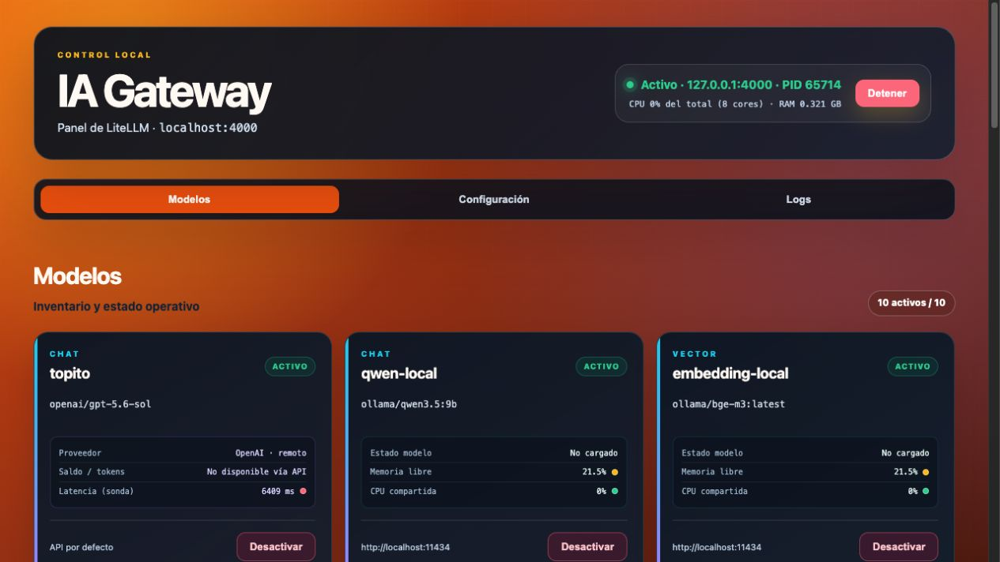
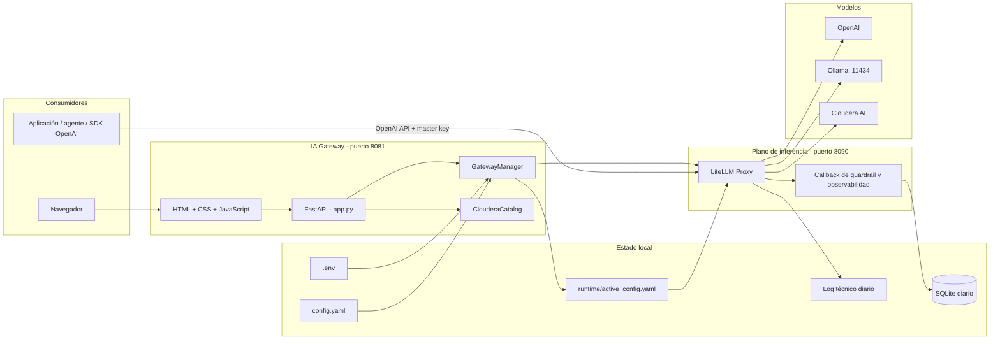
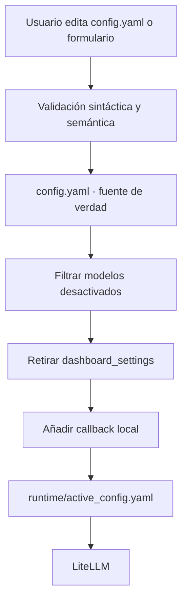
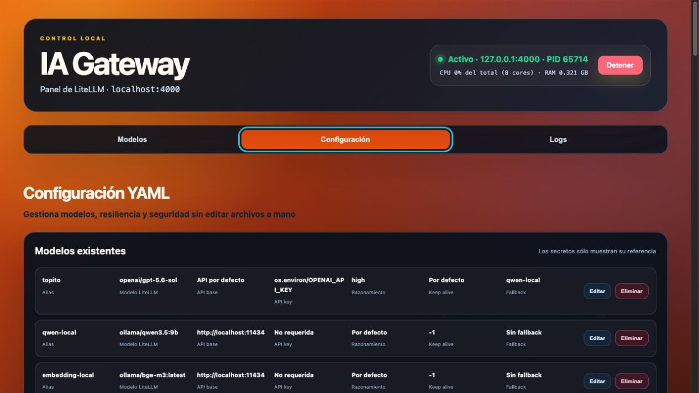
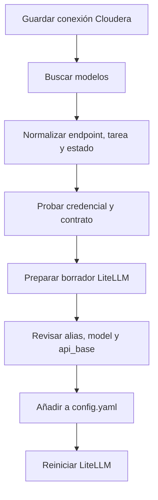
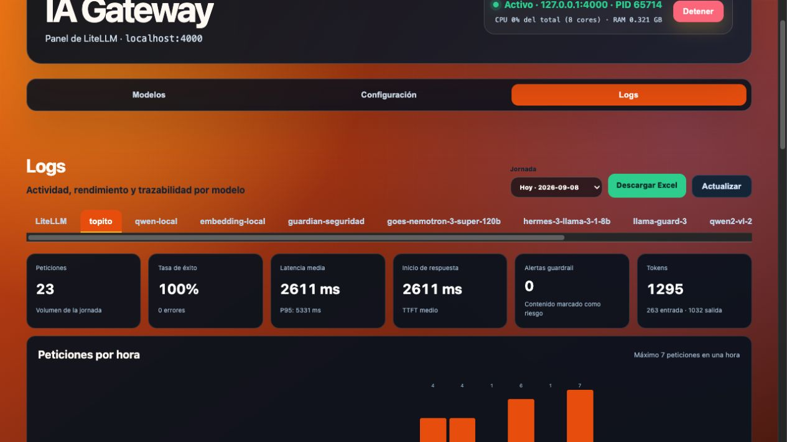
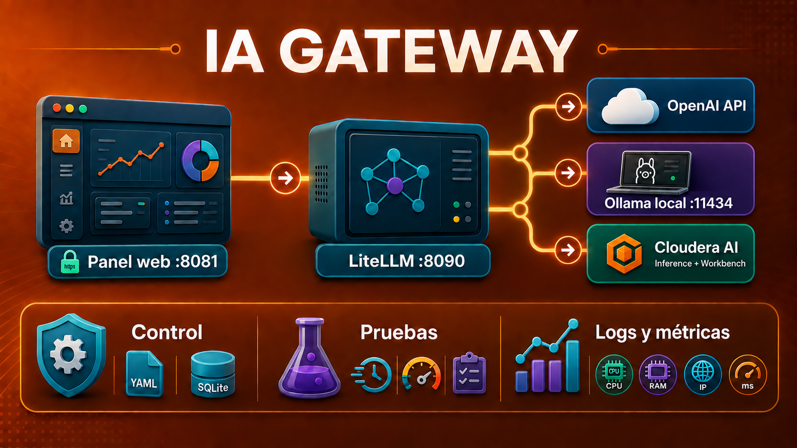

# IA Gateway

> Un panel local para convertir LiteLLM en un gateway de IA gobernable: catálogo
> de modelos, pruebas, configuración YAML, guardrails, Cloudera, métricas y logs.



IA Gateway coloca una capa de operación sencilla delante de
[LiteLLM](https://docs.litellm.ai/). Mantiene una API compatible con OpenAI para
las aplicaciones, pero permite administrar desde el navegador modelos OpenAI,
Ollama y Cloudera AI Inference/Workbench.

La idea central es separar responsabilidades. Los números siguientes son los
valores locales por defecto; en Cloudera se leen automáticamente de las
variables proporcionadas por el Workbench:

- las aplicaciones consumen una única API en el puerto `8090`;
- el panel de administración vive por **HTTPS** en el puerto `8081`;
- `config.yaml` es la fuente de verdad versionable;
- los secretos y artefactos de ejecución permanecen fuera de Git;
- cada petición deja una traza diaria consultable y exportable.

## Índice

1. [Qué ofrece](#1-qué-ofrece)
2. [Arquitectura](#2-arquitectura)
3. [Recorrido de una llamada](#3-recorrido-de-una-llamada)
4. [Instalación](#4-instalación)
5. [Arranque y parada](#5-arranque-y-parada)
6. [Cómo llamar a los modelos](#6-cómo-llamar-a-los-modelos)
7. [Configuración YAML](#7-configuración-yaml)
8. [Ollama](#8-ollama)
9. [OpenAI y proveedores compatibles](#9-openai-y-proveedores-compatibles)
10. [Cloudera](#10-cloudera)
11. [Guardrail general](#11-guardrail-general)
12. [Logs, KPIs y Excel](#12-logs-kpis-y-excel)
13. [Dimensionamiento para 100 peticiones concurrentes](#13-dimensionamiento-para-100-peticiones-concurrentes)
14. [Mapa pedagógico del código](#14-mapa-pedagógico-del-código)
15. [API del panel](#15-api-del-panel)
16. [Seguridad](#16-seguridad)
17. [Pruebas y actualización](#17-pruebas-y-actualización)
18. [Diagnóstico](#18-diagnóstico)

## 1. Qué ofrece

- Arranque y parada de LiteLLM desde la web.
- Estado real basado en PID **y** disponibilidad del puerto.
- Detección de un proceso ajeno que esté ocupando el puerto `8090`.
- CPU total y memoria RAM del árbol de procesos, actualizadas cada tres segundos.
- CRUD de modelos sin editar YAML manualmente.
- Editor avanzado con validación previa y reinicio transaccional.
- Activación/desactivación temporal sin destruir la configuración fuente.
- Fallback entre aliases.
- Prueba rápida por pestaña para chat y embeddings.
- Métricas de Ollama y sonda de latencia para proveedores remotos.
- Integración opcional con Cloudera AI Inference y AI Workbench.
- Renovación automática del CDP token.
- Guardrail previo permisivo o restrictivo.
- Logs técnicos de LiteLLM con timestamp Europe/Madrid.
- Logs estructurados por modelo y día, KPIs, gráfica horaria y Excel.

## 2. Arquitectura



### Los tres planos

| Plano | Puerto/almacén | Responsabilidad |
|---|---|---|
| Administración | `https://servidor:8081` | UI autenticada, CRUD, pruebas, salud y logs. |
| Inferencia | `127.0.0.1:8090` | API OpenAI-compatible que consumen las aplicaciones. |
| Proveedores | remoto o `:11434` | Ejecución real del modelo. |

Los puertos efectivos se resuelven al arrancar:

| Proceso | Variable | Fallback local | Binding |
|---|---|---:|---|
| Panel FastAPI | `CDSW_APP_PORT` | `8081` | `127.0.0.1` |
| LiteLLM OpenAI-compatible | `CDSW_READONLY_PORT` | `8090` | `127.0.0.1` |

Esto permite ejecutar el mismo código en macOS/Linux y como aplicación de
Cloudera AI sin editar ficheros. En local, FastAPI sirve HTTPS con el certificado
autofirmado. Cuando existe `CDSW_DOMAIN` (señal inequívoca de ejecución dentro
de Cloudera), sirve HTTP exclusivamente sobre
loopback porque el proxy de Cloudera termina TLS y publica la URL HTTPS externa.
La contraseña nunca atraviesa la red del usuario en claro en ninguno de los dos modos.

Si una variable está vacía se usa el fallback;
si contiene un valor no numérico, fuera de `1–65535`, o ambos valores coinciden,
el arranque se detiene con un mensaje explícito.

El panel no sustituye a LiteLLM. Lo administra. Una aplicación de negocio no
debería llamar al puerto `8081`; debe usar el gateway del puerto `8090`.

### Configuración fuente y configuración activa



No edites `runtime/active_config.yaml`: se vuelve a generar en cada arranque.

## 3. Recorrido de una llamada

```mermaid
sequenceDiagram
    participant C as Cliente
    participant L as LiteLLM :8090
    participant G as Guardrail
    participant P as Proveedor
    participant D as SQLite

    C->>L: POST /v1/chat/completions + LITELLM_MASTER_KEY
    L->>G: Mensajes y alias
    G-->>L: safe / warning / unavailable
    alt política restrictiva y riesgo
        L-->>C: Error; llamada bloqueada
        L->>D: Guarda bloqueo y motivo
    else permitida
        L->>P: Modelo real + credencial del proveedor
        P-->>L: Respuesta / streaming
        L->>D: Entrada, salida, IPs, TTFT, duración, tokens
        L-->>C: Respuesta OpenAI-compatible
    end
```

Hay dos autenticaciones independientes:

1. El cliente entra a LiteLLM con `LITELLM_MASTER_KEY`.
2. LiteLLM sale al proveedor con `OPENAI_API_KEY`, CDP token, token de modelo o
   ninguna clave para un Ollama local.

Nunca uses `OPENAI_API_KEY` como clave de entrada del gateway.

## 4. Instalación

### Requisitos

- macOS o Linux.
- Python 3.11 o 3.12 recomendado.
- Git.
- Ollama opcional si habrá inferencia local.
- Acceso a Internet para OpenAI o Cloudera Cloud.

Python 3.11+ evita incompatibilidades de sintaxis presentes en integraciones
opcionales recientes de LiteLLM cuando se ejecutan sobre Python 3.9.

### Clonar y crear un entorno propio

```bash
git clone <URL-DEL-REPOSITORIO> ia-gateway
cd ia-gateway

python3 -m venv .venv
source .venv/bin/activate
python -m pip install --upgrade pip
python -m pip install -r requirements.txt
```

Para desarrollo:

```bash
python -m pip install -r requirements-dev.txt
```

### Secretos

```bash
cp .env.example .env
```

Contenido mínimo:

```dotenv
LITELLM_MASTER_KEY=cambia-esto-por-una-clave-larga
OPENAI_API_KEY=sk-tu-clave-openai
```

Para simular localmente los puertos que inyectará Cloudera:

```dotenv
CDSW_APP_PORT=8081
CDSW_READONLY_PORT=8090
```

No es obligatorio definirlos en local. Las variables reales del entorno de
Cloudera tienen prioridad sobre los fallbacks.

Una clave local aleatoria se puede generar así:

```bash
openssl rand -hex 32
```

`.env` está ignorado por Git. `.env.example` sólo contiene nombres y ejemplos.

## 5. Arranque y parada

```bash
./start.sh
```

Equivalente manual:

```bash
source .venv/bin/activate
python app.py
```

Después:

1. Abre <https://127.0.0.1:8081>.
2. Acepta una sola vez el aviso del certificado autofirmado local.
3. Entra con el usuario fijo `admin` y la contraseña inicial `admin`.
4. El panel obliga a cambiarla por una contraseña robusta antes de permitir operaciones.
5. Pulsa **Arrancar** y espera `Activo · 127.0.0.1:8090 · PID ...`.

En el primer arranque **local** se generan `runtime/tls/ia-gateway.crt` y su clave privada
con permisos `0600`. El panel escucha únicamente en `127.0.0.1`, usando
`CDSW_APP_PORT` o `8081`; la cookie de sesión sólo viaja cifrada. En Cloudera no
se genera un certificado interno: su proxy ofrece el HTTPS público. Para evitar el aviso del navegador en una
instalación corporativa, importa el certificado en los equipos administradores
o sustitúyelo por uno emitido por vuestra CA interna.

El botón **Detener** termina el grupo de procesos. Al cerrar FastAPI de forma
ordenada, el `lifespan` también intenta detener el proxy hijo.

Si aparece **Conflicto · puerto 8090 ocupado por otro proceso**, existe otra
instancia que la app no controla. Detén esa instancia antes de arrancar otra;
no confundas un proxy antiguo con un error de los modelos nuevos.

## 6. Cómo llamar a los modelos

### URL correcta

Para una aplicación que corre en el mismo equipo:

```text
Base URL: http://127.0.0.1:${CDSW_READONLY_PORT:-8090}/v1
API key:  valor de LITELLM_MASTER_KEY
Model:    alias declarado en model_name
```

Ejemplos de alias: `topito`, `qwen-local`, `embedding-local` o
`goes-nemotron-3-super-120b`.

> Ambos procesos escuchan sólo en `127.0.0.1`. En Cloudera, la plataforma publica
> el puerto de la aplicación mediante su proxy administrado. En local, otro
> servidor no puede acceder directamente sin un reverse proxy seguro.

Dentro de Cloudera, las URLs publicadas siguen normalmente este patrón:

```text
Panel:    https://<$CDSW_ENGINE_ID>.<$CDSW_DOMAIN>
LiteLLM:  https://read-only-<$CDSW_ENGINE_ID>.<$CDSW_DOMAIN>/v1
```

En una Analytical Application, el panel usa el subdominio elegido para la
aplicación. La URL exterior la proporciona Cloudera; no se construye con
`127.0.0.1` ni con el número de puerto interno.

### Python con el SDK de OpenAI

Instala el cliente si tu proyecto consumidor todavía no lo tiene:

```bash
python -m pip install openai
```

```python
import os
from openai import OpenAI

client = OpenAI(
    base_url="http://127.0.0.1:8090/v1",
    # Esta es la clave de entrada a LiteLLM, no OPENAI_API_KEY.
    api_key=os.environ["LITELLM_MASTER_KEY"],
)

response = client.chat.completions.create(
    model="topito",  # alias de config.yaml
    messages=[
        {"role": "system", "content": "Eres un especialista en SQL."},
        {"role": "user", "content": "Escribe una consulta SELECT 1."},
    ],
)

print(response.choices[0].message.content)
```

Para llamar a un Ollama o Cloudera configurado cambia únicamente `model`:

```python
response = client.chat.completions.create(
    model="goes-nemotron-3-super-120b",
    messages=[{"role": "user", "content": "¿Qué es la IA generativa?"}],
)
```

### Python con `httpx`

```python
import os
import httpx

response = httpx.post(
    "http://127.0.0.1:8090/v1/chat/completions",
    headers={"Authorization": f"Bearer {os.environ['LITELLM_MASTER_KEY']}"},
    json={
        "model": "qwen-local",
        "messages": [{"role": "user", "content": "Hola"}],
    },
    timeout=120,
)
response.raise_for_status()
print(response.json()["choices"][0]["message"]["content"])
```

### `curl`

```bash
curl http://127.0.0.1:8090/v1/chat/completions \
  -H 'Content-Type: application/json' \
  -H "Authorization: Bearer $LITELLM_MASTER_KEY" \
  -d '{
    "model": "topito",
    "messages": [{"role": "user", "content": "Devuelve SELECT 1"}]
  }'
```

### Embeddings

```python
embedding = client.embeddings.create(
    model="embedding-local",
    input="Texto que quiero convertir en vector",
)
vector = embedding.data[0].embedding
print(len(vector), vector[:5])
```

Endpoint HTTP equivalente:

```text
POST http://127.0.0.1:8090/v1/embeddings
```

### Streaming

```python
stream = client.chat.completions.create(
    model="topito",
    messages=[{"role": "user", "content": "Explica una CTE de SQL."}],
    stream=True,
)
for chunk in stream:
    text = chunk.choices[0].delta.content
    if text:
        print(text, end="", flush=True)
```

### Descubrir aliases disponibles

```bash
curl http://127.0.0.1:8090/v1/models \
  -H "Authorization: Bearer $LITELLM_MASTER_KEY"
```

La [documentación de LiteLLM](https://docs.litellm.ai/) explica el contrato
OpenAI-compatible, routing, fallbacks y proveedores adicionales.

## 7. Configuración YAML

### Anatomía de un modelo

```yaml
model_list:
  - model_name: alias-que-usa-la-aplicacion
    litellm_params:
      model: proveedor/modelo-real
      api_base: https://endpoint-opcional/v1
      api_key: os.environ/NOMBRE_DE_LA_VARIABLE
      timeout: 120
      drop_params: true
```

| Campo | Significado |
|---|---|
| `model_name` | Contrato estable para tus aplicaciones. |
| `litellm_params.model` | Proveedor y modelo/deployment real. |
| `api_base` | Base del proveedor OpenAI-compatible u Ollama. |
| `api_key` | Referencia a una variable; nunca el secreto en claro. |
| `drop_params` | Descarta parámetros que el proveedor no soporta. |
| `timeout` | Tiempo máximo de proveedor. |
| `reasoning_effort` | Esfuerzo de razonamiento, si el modelo lo acepta. |
| `keep_alive` | Permanencia del modelo Ollama en memoria. |

### Fallback

```yaml
router_settings:
  fallbacks:
    - topito:
        - qwen-local
```

Si `topito` falla técnicamente, LiteLLM intenta `qwen-local`. Un fallback no es
un balanceador de calidad y no se activa porque el guardrail marque riesgo.

### Configuración guiada y avanzada



La pestaña **Configuración** permite:

- crear, leer, modificar y borrar modelos;
- mantener parámetros avanzados desconocidos por el formulario;
- renombrar referencias en fallbacks y guardrail;
- guardar con reinicio inmediato o dejar el cambio pendiente;
- validar el YAML completo antes de sustituir el fichero.

La escritura es atómica: primero se crea un temporal y después se reemplaza el
original. Si el reinicio falla, se restaura la configuración previa.

## 8. Ollama

### Preparación

```bash
ollama pull qwen3.5:9b
ollama pull bge-m3:latest
ollama pull llama-guard3
```

Ejemplo:

```yaml
- model_name: qwen-local
  litellm_params:
    model: ollama/qwen3.5:9b
    api_base: http://localhost:11434
    keep_alive: -1
    drop_params: true
```

`keep_alive: -1` evita descargar el modelo entre peticiones, reduciendo latencia
a costa de mantener RAM/VRAM ocupada. La
[FAQ oficial de Ollama](https://docs.ollama.com/faq) documenta también:

- `OLLAMA_NUM_PARALLEL`: paralelismo por modelo; valor predeterminado 1.
- `OLLAMA_MAX_LOADED_MODELS`: modelos simultáneamente residentes.
- `OLLAMA_MAX_QUEUE`: cola antes de responder 503; valor predeterminado 512.
- `OLLAMA_CONTEXT_LENGTH`: contexto y, por tanto, consumo de memoria.

Ollama advierte que la memoria crece con
`OLLAMA_NUM_PARALLEL × OLLAMA_CONTEXT_LENGTH`. El peso del modelo no basta para
dimensionar: el KV cache, contexto, cuantización y GPU cambian mucho el consumo.
Consulta además su guía de [longitud de contexto](https://docs.ollama.com/context-length).

El panel muestra estado cargado, memoria del modelo, memoria libre del host y
CPU compartida. Las tarjetas usan verde, amarillo y rojo, pero siempre incluyen
el valor textual para no depender únicamente del color.

## 9. OpenAI y proveedores compatibles

```yaml
- model_name: topito
  litellm_params:
    model: openai/gpt-5.6-sol
    api_key: os.environ/OPENAI_API_KEY
    reasoning_effort: high
    drop_params: true
```

El panel no puede conocer CPU, RAM ni cuota restante de un proveedor SaaS si su
API no lo publica. Para esos modelos usa una sonda pequeña de latencia y colorea
su estado. Una sonda correcta no garantiza cuota suficiente para cualquier
volumen: revisa límites, facturación y rate limits en el proveedor.

## 10. Cloudera

### Qué integra

- Cloudera AI Inference mediante `listEndpoints` y `describeEndpoint`.
- Cloudera AI Workbench mediante proyectos, modelos y deployments API v2.
- Endpoints OpenAI-compatible y detección explícita de Open Inference.
- Token general por conexión o token/JWT específico por modelo.
- Prueba real de inferencia mínima usando URL, tarea y modelo publicados.
- Renovación automática de CDP token diez minutos antes de caducar.

### Flujo de incorporación



Para AI Inference pega sólo el dominio de un endpoint. Si copias la URL completa,
el backend extrae automáticamente esquema y dominio para consultar las APIs de
catálogo.

El `api_base` final sí conserva la ruta publicada por Cloudera hasta `/v1`:

```yaml
- model_name: nemotron-negocio
  litellm_params:
    model: openai/nvidia/modelo-interno
    api_base: https://ml-ejemplo.cloudera.site/namespaces/serving-default/endpoints/endpoint/v1
    api_key: os.environ/CLOUDERA_<CONEXION>_CDP_TOKEN
    drop_params: true
```

La aplicación traduce el alias público al identificador estricto esperado por
Cloudera justo antes de contactar con el proveedor.

### Credenciales y renovación

Prioridad de credenciales:

1. JWT/API key específica del endpoint.
2. CDP token general de la conexión.

En Public Cloud, la renovación utiliza `CDP_ACCESS_KEY_ID` y `CDP_PRIVATE_KEY`
para firmar `generateWorkloadAuthToken` mediante CDP CLI. En on-premise puede
usar `WORKLOAD-USER` y `WORKLOAD-PASS` contra la ruta Knox configurada.

Cada minuto el supervisor comprueba caducidad. Cuando quedan diez minutos:

1. marca “token próximo a caducar, generando de nuevo”;
2. solicita un token nuevo;
3. sustituye el secreto de forma atómica;
4. reintenta al minuto si falla;
5. reinicia LiteLLM si estaba activo para recargar el entorno.

El YAML contiene sólo `os.environ/...`; el JWT real permanece en
`runtime/cloudera-connections.json`, con permisos `0600`. Es un almacén local
restringido, no un gestor de secretos cifrado.

Cloudera AI Inference soporta autoscaling por RPS o concurrencia por réplica,
incluido scale-to-zero. Véanse los conceptos de
[autoscaling de endpoints](https://docs.cloudera.com/machine-learning/cloud/ai-inference/topics/ml-caii-caii-concepts.html)
y la guía de [sensibilidad del autoscaling](https://docs.cloudera.com/machine-learning/cloud/ai-inference/topics/ml-caii-tuning-auto-scale-sensitivity-use-api.html).

## 11. Guardrail general

El guardrail es **opcional**. Si se elige “Sin guardrail · llamada directa”, las
peticiones van al modelo de destino sin clasificación previa. Sólo cuando se
selecciona un modelo guardrail se ejecuta **antes** de los demás modelos de chat.
El modelo de seguridad suele ser un `llama-guard` local en Ollama para evitar coste
externo y recursión.

```yaml
dashboard_settings:
  guardrail:
    enabled: true
    model: guardian-seguridad
    policy: warn
    timeout: 8
```

`dashboard_settings` pertenece a IA Gateway. `GatewayManager` la retira del
YAML activo antes de arrancar LiteLLM y genera un JSON runtime para el callback.

### Política permisiva: `warn`

- Clasifica cada entrada.
- Si es segura, continúa normalmente.
- Si parece peligrosa, añade advertencia y motivo, pero continúa.
- Si el guardrail no responde, registra “no disponible” y continúa.
- Reduce la frustración por falsos positivos.

Úsala al comenzar, en entornos de análisis y cuando una respuesta del modelo
principal pueda seguir siendo útil bajo revisión humana.

### Política restrictiva: `block`

- Clasifica antes de usar el modelo principal.
- Bloquea contenido marcado como inseguro.
- También bloquea si el guardrail no pudo evaluar la petición.
- Evita consumir el modelo principal en una entrada rechazada.

Úsala cuando el riesgo de dejar pasar contenido sea mayor que el coste de un
falso positivo. Asegura disponibilidad y capacidad del modelo guardrail: pasa a
formar parte del camino crítico.

### Por qué el guardrail tiene sus propios logs

El callback consulta Ollama directamente para no volver a entrar en LiteLLM y
crear una recursión infinita. Registra dos hechos relacionados:

- la evaluación en la pestaña del modelo guardrail;
- el veredicto dentro de la llamada del modelo principal.

Esto permite medir cuántas evaluaciones se hicieron y qué peticiones recibieron
advertencia o bloqueo.

## 12. Logs, KPIs y Excel



### Dos familias de logs

| Log | Formato | Contenido |
|---|---|---|
| LiteLLM | `runtime/logs/litellm-AAAA-MM-DD.log` | stdout/stderr técnico con timestamp Madrid. |
| Modelo | `runtime/logs/AAAA-MM-DD.sqlite3` | Peticiones estructuradas por alias. |

La pestaña LiteLLM permite elegir día, actualizar y **Limpiar**. Limpiar sólo
vacía el fichero técnico seleccionado; no borra auditoría de modelos.

Cada evento estructurado conserva, cuando el proveedor lo entrega:

- fecha y hora Europe/Madrid;
- alias;
- estado correcto/error;
- IP origen y destino resuelto;
- pregunta/entrada y respuesta/salida;
- TTFT o tiempo hasta inicio de respuesta;
- duración total;
- tokens de entrada, salida y total;
- veredicto y motivo del guardrail.

Antes de persistir, claves comunes como `authorization`, `api_key`, `token` y
`secret` se sustituyen por `[OCULTO]`. Aun así, prompts y respuestas pueden
contener datos personales o de negocio: aplica retención y acceso adecuados.

### KPIs diarios

- peticiones;
- tasa de éxito y errores;
- latencia media y P95;
- TTFT medio;
- alertas del guardrail;
- tokens;
- peticiones por cada una de las 24 horas.

**Descargar Excel** crea una hoja con KPIs, filtros, cabecera congelada y detalle.
El fichero se genera en memoria y no necesita Excel instalado en el servidor.

## 13. Dimensionamiento para 100 peticiones concurrentes

### Primero: qué significa “concurrente”

No es lo mismo:

- aceptar 100 conexiones y mantener 96 en cola;
- inferir realmente 100 respuestas al mismo tiempo;
- recibir 100 solicitudes en un segundo;
- sostener 100 solicitudes durante varios minutos;
- responder 100 prompts cortos o 100 contextos de 64k tokens.

Por eso no existe una cifra universal de CPU/RAM. El dimensionamiento necesita:

- modelo y cuantización;
- longitud de prompt y salida;
- streaming;
- latencia objetivo (P95/P99);
- tokens por segundo requeridos;
- proveedor remoto o local;
- tasa de llegada y duración del pico.

### Gateway con modelos remotos

Cuando OpenAI o Cloudera hacen la inferencia, IA Gateway trabaja sobre todo con
red, serialización, autenticación y logs. Punto de partida para una prueba:

| Componente | Base de laboratorio | Producción inicial orientativa |
|---|---:|---:|
| IA Gateway + LiteLLM | 2 vCPU, 4 GiB RAM | 4 vCPU, 8 GiB RAM |
| Disco | SSD, 5 GiB libres | SSD y política de retención |
| Red | estable | baja latencia hacia proveedores |

Estas cifras son una **hipótesis de carga**, no una garantía. La versión actual
es una aplicación local de una sola instancia y SQLite. Antes de prometer 100
concurrentes hay que ejecutar una prueba con prompts representativos y observar
errores, P95, CPU, memoria, descriptores y crecimiento de logs.

Para alta disponibilidad real hacen falta, además, reverse proxy, TLS, varias
réplicas del gateway, estado/logging compartido y coordinación de procesos.

### Cloudera AI Inference

Cloudera permite autoscaling por concurrencia por réplica. Una primera hipótesis
para 100 solicitudes simultáneas podría ser:

```text
objetivo = 25 concurrentes por réplica
réplicas teóricas = ceil(100 / 25) = 4
máximo sugerido para absorber margen = 5
mínimo cálido/HA sugerido = 2
```

El valor 25 es sólo un punto inicial que debe validarse con el modelo concreto.
La propia documentación de Cloudera muestra configuraciones por concurrencia y
advierte que el cluster debe disponer de nodos/GPU suficientes. Consulta
[configuración y sizing](https://docs.cloudera.com/machine-learning/cloud/setup-cloudera-ai-inference/topics/ml-caii-caii-configuration-sizing.html).

Evita `min_replicas: 0` si el primer usuario no puede asumir cold start. Reserva
capacidad adicional para rolling updates: durante una actualización pueden
coexistir réplicas viejas y nuevas.

### Ollama local

Con valores predeterminados, Ollama procesa una petición paralela por modelo y
puede encolar hasta 512. Por tanto, 100 peticiones pueden ser **aceptadas**, pero
no necesariamente ejecutadas a la vez; su latencia de cola crecerá.

No configures `OLLAMA_NUM_PARALLEL=100` a ciegas. Cada incremento multiplica el
contexto efectivo y el KV cache. En una sola estación de trabajo suele ser más
sensato empezar con 2 o 4, medir VRAM/TTFT/tokens por segundo y escalar mediante
réplicas/nodos si el SLO exige paralelismo real.

Una estimación conceptual es:

```text
memoria ≈ pesos cuantizados del modelo
        + KV cache(contexto × solicitudes paralelas)
        + buffers del motor
        + margen del sistema
```

Para 100 generaciones simultáneas de un LLM grande normalmente se necesita un
servicio de inferencia distribuido con varias GPU, no sólo más RAM para LiteLLM.

### Plan de prueba recomendado

1. Define P95 máximo y tasa de error aceptable.
2. Crea prompts P50/P95 realistas y límites de salida.
3. Calienta modelos antes de medir.
4. Ejecuta escalones: 1, 5, 10, 25, 50 y 100 concurrentes.
5. Mantén cada escalón el tiempo suficiente para estabilizar autoscaling.
6. Mide gateway y proveedor por separado.
7. Revisa 429/503, colas, TTFT, duración, tokens/s y saturación GPU.
8. Repite con guardrail activado: duplica el número lógico de inferencias.
9. Añade 20–30% de margen sólo después de obtener resultados.

## 14. Mapa pedagógico del código

### Árbol del repositorio

```text
ia-gateway/
├── app.py
├── config.yaml
├── .env.example
├── requirements.txt
├── requirements-dev.txt
├── start.sh
├── installacion_litellm.txt
├── gateway/
│   ├── __init__.py
│   ├── core.py
│   ├── cloudera.py
│   ├── litellm_callback.py
│   ├── log_store.py
│   └── excel_export.py
├── static/
│   ├── index.html
│   ├── app.js
│   ├── style.css
│   └── ia-gateway-arquitectura.png
├── docs/assets/
│   ├── dashboard-modelos.png
│   ├── dashboard-configuracion.png
│   ├── dashboard-logs.png
│   └── ia-gateway-arquitectura.png
├── tests/
│   ├── test_app.py
│   ├── test_core.py
│   └── test_cloudera.py
└── runtime/                 # generado, privado y fuera de Git
```

### `app.py`: adaptador HTTP

Es la composición principal:

- carga `.env`;
- crea `GatewayManager` y `ClouderaCatalog`;
- define modelos Pydantic para validar entradas;
- publica endpoints FastAPI;
- sirve la SPA;
- ejecuta cada minuto el supervisor de tokens;
- detiene LiteLLM al cerrar el panel.

Funciones destacadas:

| Función | Papel |
|---|---|
| `gateway_auth_headers` | Añade la master key sólo en servidor. |
| `_model_entry` | Convierte formulario seguro a entrada YAML. |
| `test_model` | Decide chat/embedding y llama al puerto 8090. |
| `model_latency` | Sonda remota pequeña para el semáforo. |
| `refresh_cloudera_tokens` | Renueva secretos y recarga el proxy. |

Los endpoints deben ser finos: validan/transforman HTTP y delegan reglas.

### `gateway/core.py`: dominio operativo

`GatewayManager` es el dueño del ciclo de vida y configuración:

- valida alias, listas y referencias;
- implementa CRUD y fallbacks;
- filtra modelos temporalmente desactivados;
- genera `active_config.yaml`;
- construye el entorno del hijo;
- arranca/detiene el grupo de procesos;
- distingue PID, puerto listo y conflicto;
- calcula CPU/RAM y recursos Ollama;
- rota y lee el log técnico.

La actualización transaccional conserva el fichero anterior y lo restaura si
la nueva configuración no consigue arrancar.

### `gateway/cloudera.py`: frontera Cloudera

`ClouderaCatalog` encapsula:

- almacén local con permisos `0600`;
- CRUD de conexiones;
- saneado de respuestas para nunca devolver secretos;
- lectura informativa de caducidad JWT;
- renovación Cloud y on-premise;
- prioridad de credenciales;
- descubrimiento de dos familias API;
- normalización de modelos;
- pruebas mínimas de chat, completions, embeddings o readiness.

Decodificar `exp` de un JWT **no verifica su firma**; sólo permite presentar su
fecha declarada. La validación auténtica ocurre cuando Cloudera acepta la llamada.

### `gateway/litellm_callback.py`: camino transversal

LiteLLM carga `dashboard_logger`, una instancia de `DashboardLogger`:

- `async_pre_call_hook` ejecuta el guardrail y adapta el modelo Cloudera;
- `async_log_success_event` persiste respuestas correctas;
- `async_log_failure_event` persiste errores con el mismo esquema;
- auxiliares extraen alias, IP, TTFT y metadatos tolerando proveedores distintos.

Un callback de observabilidad nunca debería derribar una inferencia por un fallo
de logging. Por eso sus auxiliares degradan a valores desconocidos.

### `gateway/log_store.py`: persistencia

- `safe_value` recorre objetos, limita profundidad y redacta secretos.
- `connect` crea SQLite, activa WAL y aplica migraciones idempotentes.
- `insert_log` usa una transacción corta.
- `read_day_logs` combina formato diario y base histórica anterior.
- `log_kpis` calcula indicadores sin mezclar presentación HTML.

SQLite WAL permite lectores mientras se escribe, adecuado para una instancia
pequeña. No equivale a una plataforma distribuida de observabilidad.

### `gateway/excel_export.py`: OOXML

Genera directamente las piezas XML de un XLSX y las empaqueta en ZIP. Evita una
dependencia ofimática pesada y produce siempre el mismo formato.

### `static/index.html`: estructura

Define tres vistas accesibles, formularios, diálogos y contenedores vacíos. No
contiene secretos ni datos de negocio; JavaScript hidrata todo desde `/api`.

### `static/app.js`: estado del navegador

Está dividido conceptualmente en:

1. cliente HTTP y escape XSS;
2. catálogo/sondas Cloudera;
3. estado y métricas de modelos;
4. CRUD y YAML;
5. prueba rápida;
6. logs, KPIs y Excel;
7. inicialización y temporizadores.

No usa framework para que el flujo `fetch → estado → DOM` sea visible al alumno.

### `static/style.css`: sistema visual

Variables CSS definen naranja, azul noche, estados y espaciado. Media queries
adaptan tarjetas y formularios; color y texto comunican conjuntamente el estado.

### `config.yaml`, `.env` y `runtime`

- `config.yaml`: comportamiento declarativo versionable.
- `.env`: secretos generales no versionados.
- `runtime/state.json`: aliases temporalmente apagados.
- `runtime/cloudera-connections.json`: conexiones y secretos locales.
- `runtime/dashboard_settings.json`: puente panel→callback.
- `runtime/active_config.yaml`: configuración efectiva.
- `runtime/litellm.pid`: proceso administrado.
- `runtime/logs/`: observabilidad diaria.

### Pruebas

- `test_app.py`: contrato HTTP, autenticación y elementos UI esenciales.
- `test_core.py`: YAML, proceso, métricas, logs, Excel y CRUD.
- `test_cloudera.py`: secretos, normalización, descubrimiento, pruebas y tokens.

Los tests usan directorios temporales y dobles HTTP; no deben consumir cuota real.

## 15. API del panel

Swagger autenticado: <https://127.0.0.1:8081/api/docs>

| Método | Ruta | Uso |
|---|---|---|
| `GET/POST` | `/api/auth/status`, `/api/auth/login` | Estado e inicio de sesión. |
| `POST` | `/api/auth/change-password`, `/api/auth/logout` | Rotación y cierre de sesión. |
| `GET` | `/api/status` | Proceso, puerto, PID, conflicto, CPU y RAM. |
| `POST` | `/api/gateway/start` | Genera runtime y arranca LiteLLM. |
| `POST` | `/api/gateway/stop` | Detiene LiteLLM. |
| `GET` | `/api/models` | Inventario saneado. |
| `PUT` | `/api/models/{name}/state` | Activación temporal. |
| `POST` | `/api/models/{name}/test` | Prueba rápida. |
| `GET` | `/api/model-resources` | Métricas por modelo. |
| `GET/PUT` | `/api/config` | Leer o sustituir YAML. |
| `POST` | `/api/config/validate` | Validar sin guardar. |
| `POST/PUT/DELETE` | `/api/config/models...` | CRUD guiado. |
| `PUT` | `/api/config/guardrail` | Política transversal. |
| `GET/POST/PUT/DELETE` | `/api/cloudera/connections...` | CRUD y catálogo CDP. |
| `POST` | `/api/cloudera/connections/{id}/probe-model` | Prueba endpoint. |
| `GET` | `/api/models/{name}/logs` | Datos y KPIs diarios. |
| `GET` | `/api/models/{name}/logs.xlsx` | Exportación Excel. |
| `GET/DELETE` | `/api/process-log` | Leer o limpiar log técnico. |

## 16. Seguridad

- El único usuario es `admin`; la contraseña inicial `admin` debe cambiarse en el primer acceso.
- La contraseña se almacena como hash **Argon2id** con sal aleatoria, nunca en claro.
- Las sesiones duran ocho horas: la cookie es opaca, `HttpOnly`, `Secure` y `SameSite=Strict`.
- Las operaciones de escritura exigen además un token CSRF ligado a la sesión.
- Tras cinco intentos fallidos desde una IP, el login se bloquea durante 15 minutos.
- Cambiar la contraseña invalida todas las demás sesiones activas.
- En local, el panel usa HTTPS autofirmado y cabeceras CSP/HSTS; en Cloudera, el proxy de la plataforma termina TLS y el servicio interno queda limitado a `127.0.0.1`.
- No expongas `:8090` a Internet sin TLS, firewall y gestión de claves.
- Rota cualquier token pegado accidentalmente en chat, log o captura.
- Mantén `.env` y `runtime/` fuera de Git y de copias no cifradas.
- Restringe permisos del usuario del proceso.
- Trata prompts/respuestas como información potencialmente sensible.
- Define retención de SQLite y logs técnicos.
- Recuerda que `0600` limita acceso local, pero no cifra el contenido.
- Usa un gestor de secretos para un despliegue compartido/producción.
- No confundas guardrail de contenido con aislamiento, autorización o DLP.

## 17. Pruebas y actualización

### Ejecutar la suite

```bash
source .venv/bin/activate
python -m pytest -q
```

### Actualizar el repositorio

```bash
git status
git pull --ff-only
source .venv/bin/activate
python -m pip install -r requirements.txt
python -m pytest -q
```

Después reinicia el panel y aplica la configuración desde la cabecera.

Antes de actualizar:

- revisa cambios locales;
- respalda `.env`, `config.yaml` y `runtime/cloudera-connections.json` de forma
  segura;
- no sobrescribas una configuración operativa con ejemplos.

## 18. Diagnóstico

### “Invalid model name” para modelos recién añadidos

1. Consulta `/v1/models` con la master key.
2. Verifica que el alias aparece.
3. Comprueba que no exista un proceso antiguo ocupando `:8090`.
4. Reinicia LiteLLM desde el panel.
5. Revisa el log técnico con timestamps.

Un `ProxyModelNotFoundError` ocurre dentro del router, antes del proveedor.

### “Authentication failed”

- Entrada `:8090`: revisa `LITELLM_MASTER_KEY`.
- OpenAI: revisa `OPENAI_API_KEY` y facturación API.
- Cloudera: prueba token general/específico, permisos y caducidad.
- Ollama local: normalmente no necesita API key de proveedor.

### Proceso con PID pero puerto inaccesible

El proceso puede estar vivo mientras su servidor falló. El panel exige ambas
señales. Consulta el log LiteLLM y comprueba conflictos de puerto.

### Ollama responde lento o devuelve 503

- revisa `ollama ps`;
- observa RAM/VRAM libre;
- reduce contexto o paralelismo;
- aumenta la cola sólo si la latencia resultante es aceptable;
- precarga y usa `keep_alive` cuando tenga sentido.

### Cloudera escala desde cero

La primera solicitud puede asumir arranque de nodo, descarga de imagen/modelo y
creación de réplica. Para latencia predecible usa al menos una réplica mínima y
capacidad de cluster suficiente.

---

## Resumen visual



IA Gateway es deliberadamente pequeño: una capa de control HTTPS autenticada,
una API unificada y trazabilidad útil. Para una plataforma empresarial distribuida
deben añadirse alta disponibilidad, una CA corporativa, almacenamiento compartido,
retención y pruebas de carga con SLO explícitos.
